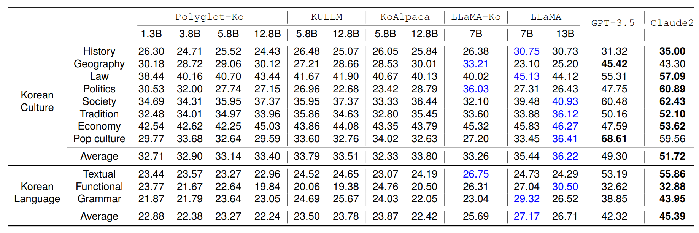

# AI 모델 선택

1. [앱 개발을 위한 AI 활용](./choosing_ai_model.md#1-애플리케이션-개발을-위한-ai-활용)
2. [모델 선택](./choosing_ai_model.md#2-모델-선택)
3. [모델 사용 사례](./choosing_ai_model.md#3-ai-모델-사용-사례)
4. [로컬 개발을 위한 모델 찾기](./choosing_ai_model.md#4-로컬-개발을-위한-모델-찾기)

 
 

## 1. 애플리케이션 개발을 위한 AI 활용

AI의 획기적인 발전으로 소프트웨어가 해결할 수 있는 문제의 수가 늘어났습니다. 이를 통해 애플리케이션 개발자는 최근에 통합하기 어려웠던 기능을 만들 수 있는 새로운 가능성이 열립니다.

대규모 모델을 학습하고 실행하려면 GPU나 NPU와 같은 강력하고 값비싼 하드웨어 가속기가 필요합니다. AI 애플리케이션 코딩을 시작하려면 이러한 하드웨어가 필요하다고 생각할 수 있습니다. 그러나 표준 개발자 머신과 Podman AI Lab을 사용하여 AI 애플리케이션에서 작업할 수 있습니다.

이 섹션에서는 이러한 새로운 AI 기능을 사용 사례와 모델에 매핑하여 개발자가 지능형 애플리케이션에서 작업하는 데 사용할 수 있습니다. 특히 사전 학습된 오픈 소스 모델은 모델 학습에 대한 대규모 투자 없이도 AI에 액세스할 수 있도록 합니다.

Podman Desktop AI Lab 확장 프로그램에서 사전 학습된 모델의 큐레이팅된 목록을 찾을 수 있습니다. 또한 머신 러닝 기술을 공유하고 협업하는 데 사용되는 온라인 커뮤니티 플랫폼인 **Hugging Face Hub**에서 수천 개의 모델을 찾을 수 있습니다.
 
 

## 2. 모델 선택

애플리케이션을 위한 AI 모델을 선택하는 것은 다음과 같은 측면을 고려해야 하는 프로세스입니다.

### 2.1 사용 사례

AI 모델을 사용하여 구현하려는 기능입니다.
* 사용 사례는 일반적으로 각 모델 패밀리가 서로 다른 작업과 목적에 적합하기 때문에 모델을 선택하는 데 중요한 요소
* 예
  + 대화형 도우미를 구축하려는 경우 대규모 언어 모델(LLM: Large Language Model)을 고려
  + 이미지 분류 시나리오에서 작업하는 경우 합성곱 신경망(CNN: Convolutional Neural Network)이 더 적합한 솔루션
 

### 2.2 라이선스

모델과 모델을 학습하는 데 사용된 **데이터 세트**의 라이선스입니다.
* 모델이 독점 데이터로 학습되었는지 또는 출처가 불분명한 데이터 세트로 학습되었는지 확인 필요
* 또한 많은 모델이 기본 모델의 파생 모델이므로 기본 모델의 라이선스를 확인 필요
* 올바른 라이선스 조건을 준수하는 것은 어렵고 많은 조직이 여전히 사전 학습된 모델을 합법적으로 사용할 수 있는지 여부를 판단하는 데 어려움을 겪고 있음
 

### 2.3 미세 조정 (Fine Tuning) 요구 사항

사용 사례에 따라 모델을 시나리오에 완전히 적용하기 위해 특정 데이터로 사전 학습된 모델을 미세 조정해야 할 수 있습니다.
* 이 경우 강력한 하드웨어가 필요
* 프로세스에 몇 시간 또는 며칠이 걸릴 수 있으므로 교육 시간도 고려
* LLM의 경우, 대량의 데이터에 액세스하거나 합성적으로 생성 필요
 

### 2.4 추론 비용 (Inference Costs)

모델을 실행하는 데 필요한 리소스는 모델을 교육하는 데 필요한 리소스보다 적지만 LLM의 경우 프로덕션 시나리오에 GPU 또는 기타 컴퓨팅 가속기가 여전히 필요합니다.

사전 학습된 모델은 실험에 적합하지만 프로덕션 사용에 대한 라이선스, 미세 조정 및 비용을 고려해야 할 수 있습니다.
 
 

## 3. LLM 이름

### 3.1 브래드 명

모델의 브랜드를 나타내는 이름
* 같은 회사에서 제작하고 공통 아키텍처와 학습 데이터를 공유하는 모델 그룹을 식별
* 이름도 모델 개발자와 의도한 브랜딩 메시지에 따라 달라짐
* 예
  + IBM의 granite 모델: 견고한 신뢰성을 의미
  + Meta의 Llama: 이는 약어로, Large Language Model Meta AI의 약자
 

### 3.2 버전 (versions)

브랜드 이름과 함께 버전 번호가 일반적으로 포함
* 대부분의 모델은 주(major) 버전 번호와 부(minor) 버전 번호를 사용하는 간소화된 의미적 버전 관리 시스템을 사용
  + 패치 버전은 생략되는 경우가 많음
* 주(major) 버전 번호 변경
  + 일반적으로 기본 모델 아키텍처 또는 학습 기법의 업데이트, 학습 데이터 업데이트, 또는 모델 성능의 상당한 변화와 같은 주요 변경 사항을 나타냄
  + vLLM과 같은 LLM 지원 도구와의 호환성 문제를 나타낼 수 있으며, 이는 새 모델 버전을 지원하기 위해 새로운 릴리스가 필요할 수 있음을 의미
* 부(minor) 버전 번호 변경은 일반적으로 모델의 점진적인 개선 또는 업데이트된 데이터에 대한 재학습을 의미
 

### 3.3 모델 크기 (Model Size)

대부분의 모델은 모델 이름에 *`8B`* 또는 *`278M`*과 같은 숫자를 포함
* 매개변수 개수가 10억(B) 또는 수백만(M)임을 나타냄
* 매개변수(또는 가중치)는 학습 과정에서 학습된 숫자 값으로, 응답 생성 시 모델의 계산에 사용됨
* 매개변수의 개수는 모델이 파일로 저장될 때의 크기와 GPU에 모델을 로드하는 데 필요한 vRAM 용량에 직접적인 영향을 미침
  + 예1) *`granite-3.2-8b-instruct`*는 제한된 컨텍스트 길이를 가진 24GB vRAM의 A10 GPU에 적합
  + 예2) *`llama-3.1-405b-instruct`*는 900GB 이상의 vRAM이 필요하며, 일반적으로 각각 80GB vRAM을 사용하는 16대의 H100에서 실행
 

### 3.4 모델 목적

**LLM 사용목적**
* LLM은 다양한 작업을 위해 설계되었으며, 각 작업의 사용 사례를 이해하는 것은 적절한 모델을 선택하는 데 매우 중요
* 모델의 목적은 종종 특정 모델 이름에 직접 포함

#### 3.4.1 베이스(base) 모델

* 기본 모델은 다른 보다 전문화된 모델의 시작점이 되는 일반적인 모델
* 이러한 모델은 기본적으로 사용되는 경우는 드물며, 일반적으로 특정 목적에 맞게 모델을 미세 조정하는 기반 역할을 수행
* 모델 이름에 *`base`*를 포함하여 모델이 미세 조정용임을 명시하는 회사도 있지만, 그렇지 않은 회사도 있음

#### 3.4.2 인스트럭트(instruct) 모델

**가장 일반적인 모델 유형 중 하나**
* 대화형 모델을 찾고 있다면 이 모델이 가장 적합
* 해당 모델은 수행해야 할 작업을 지시하도록 미세 조정되어 있으며, 신속한 엔지니어링 및 일반적인 채팅 사용 사례에 이상적
* 일부 이전 모델에서는 모델을 설명하기 위해 "채팅"을 사용했지만, 대부분의 최신 모델에서는 "지시" 대신 "채팅"을 사용하는 것이 더 이상 선호되지 않

#### 3.4.3 비전(vision) 모델

**빠르게 도입되고 있는 새로운 유형의 모델** 
* *`granite-vision-3.2-2b`*와 같은 비전 모델은 일반적으로 다중 모드(multi-modal)를 지원하여 텍스트와 이미지를 입력으로 받고 텍스트를 출력으로 제공
* 비전 모델은 이미지에 대한 질문을 하거나, 모델에게 이미지의 내용을 설명하도록 요청하거나, 이미지를 텍스트로 변환하는 데 유용
* 예) *`vision-instruct`*라는 라벨이 붙은 모델
  + 이는 두 가지 기능을 모두 수행하도록 최적화
  + 비전 작업도 수행할 수 있는 일반적인 채팅 모델을 찾고 있다면 좋은 선택이 될 수 있음

#### 3.4.4 코드(code) 모델

**코딩 활동 및 코딩 도우미를 지원하도록 최적화**
* 전용 코드 모델은 일반적인 교육 모델에 비해 선호도가 떨어짐
* 많은 최신 교육 모델에는 코드 모델 역할을 하는 기능이 포함될 예정

#### 3.4.5 임베드(embedding) 모델

**임베딩**
* 텍스트를 벡터 데이터베이스에서 저장, 쿼리 및 검색할 수 있는 숫자 토큰으로 변환하는 과정

**임베딩 모델**
* 명령어 모델과 함께 검색 증강 생성(RAG: Retrieval-Augmented Generation)에 자주 사용

#### 3.4.6 가드(guard 또는 guardian) 모델

**안전하지 않은 콘텐츠나 질문을 식별하는 데 도움을 주도록 설계**
* 가드 모델은 채팅 기반 워크플로에서 자주 사용
* 사용자의 질문이 먼저 가드 모델로 전송되어 진행이 안전한지 판단한 후, 지시(instruct) 모델로 전송
* 경우에 따라 가드 모델은 LLM의 응답에도 사용되어 모델이 허용되지 않는 콘텐츠로 응답하지 않는지 확인
  + 가드 모델이 허용되지 않는 언어를 감지하는 경우, 해당 유형의 질문에는 응답할 수 없다는 간단한 사전 정의된 응답을 보내는 경우가 많음

#### 3.4.7 추론(reasoning) 모델

* DeepSeek R1은 최근 전 세계와 주식 시장에 큰 반향을 일으키며 일반 대중에게 추론 모델을 제시
* 단순히 시퀀스의 다음 단어를 예측하는 기존 LLM과 달리, 추론 모델은 최종 답변을 제공하기 전에 내부적으로 질문을 던지고 다듬는 사고의 사슬을 통해 작동
 

### 3.5 모델 양자화

**양자화**
* 32비트 또는 16비트 부동 소수점 숫자와 같은 고정밀 데이터 유형의 모델 가중치를 8비트 부동 소수점 또는 정수 값과 같은 저정밀 데이터 유형으로 변환하는 프로세스
* 이러한 데이터 유형을 변환하면,
  + 디스크에서 모델 크기를 크게 줄일 수 있음
  + vRAM에 로드할 때 정확도와 응답 품질이 저하될 수 있음
* 예) *`Llama 405b`* 모델은 fp16 데이터 유형을 사용하여 900GB 이상이 필요하지만, 이를 fp8로 변환하면 모델 크기가 약 450GB로 줄어듦

**양자화된 모델 이름**
* *`fp8`* 또는 *`int8`*과 같은 용어는 양자화된 모델이 사용하는 데이터 유형
* Neural Magic의 양자화
  + Neural Magic 모델은 *`w4a16`*과 같은 명명 규칙을 사용
    - 가중치 매개변수는 4비트 값을 사용
    - 활성화 매개변수는 원래 16비트 데이터 유형을 유지
  + Neural Magic은 고급 양자화 기술을 사용하여 정확도와 성능에 미치는 영향을 최소화하면서 다양한 시나리오에 맞게 모델을 최적화
* 양자화된 모델을 선택하면,
  + 모델 실행 비용을 절감
  + 모델 서버가 처리할 수 있는 토큰 수를 늘림
 

### 3.6 모델 증류

**증류(Distillation)**
* 큰 모델을 기반으로 더 작고 효율적인 모델을 생성하는 기법
  + 최근 DeepSeek을 통해 주목을 받고 있음
* 간단히 말해,
  + 증류는 데이터 과학자가 기존의 큰 모델(교사 모델)을 사용하여 새롭고 더 작은 모델(학생 모델)을 생성하는 기법
  + 이 기법은 학습 시간을 단축하고 교사 모델보다 더 작고 빠른 모델을 생성하면서도 유사한 정확도와 응답 품질을 유지
* 예) *`deepseek-r1-distill-llama-70b`* 모델은 *`Llama 70B`*를 교사 모델로 사용하여 학습되었음
 
 

## 4. AI 모델 사용 사례

AI와 머신 러닝에 익숙하지 않다면 현대 AI 기술이 해결할 수 있는 문제의 종류에 대해 명확한 생각이 없을 수 있습니다. 

### 4.1 AI 사용 사례 예

|$\color{lime}{\texttt{분류}}$|$\color{lime}{\texttt{소분류}}$|$\color{lime}{\texttt{사용 사례}}$|
|:---|:---|:---|
|Natural Language Processing (NLP)|Text Generation Text Classification Named Entity Recognition (NER) Translation|Chatbots, content creation, automated writing assistance Sentiment analysis, spam detection, topic classification Extracting entities such as names, dates or locations, from text Automated translation services|
|Computer Vision|Image Classification Object Detection Image Segmentation|Object recognition, image categorization Custom object detection tasks Medical image analysis, autonomous driving|
|Audio Signal Processing|Speech Processing Audio Classification|Speech-to-text, text-to-speech Language identification, music recommendation systems|
 

### 4.2 멀티-모달 (Multi-Modal)

* 텍스트와 이미지와 같이 여러 데이터 형식을 입력으로 사용하는 모델
* 멀티모달 모델은 문서, 사진 또는 시계열 데이터를 포함한 복잡한 데이터에 대한 질문에 답할 수 있음
 

### 4.3 공개적으로 사용 가능한 AI 모델 예

* 대화형 도우미를 만드는 *instructlab/granite-7b-lab* 모델
* 이미지에서 객체 감지를 위한 *facebook/detr-resnet-101* 모델
* 오디오 필사를 위한 *openai/whisper-small* 모델

> [!NOTE]
> 사용 사례와 사용 가능한 모델의 포괄적인 목록은 *https://huggingface.co/tasks*를 참조하세요.
 

> [!NOTE]
> 이전 분류는 사전 학습된 오픈 소스 모델이 있는 사용 사례에 초점을 맞춥니다. 분류 또는 회귀와 같은 다른 사용 사례에서는 비즈니스별 데이터를 사용하여 모델을 학습해야 할 수 있습니다. 
> 예를 들어, 전자 상거래 사이트의 전환율을 예측하려면 데이터로 회귀 모델을 학습할 수 있습니다. 이러한 사례 중 일부에서는 전이 학습(transter learning)과 같은 기술을 사용하여 사전 학습된 모델을 사용할 수도 있습니다.
 
 

## 5. 로컬 개발을 위한 모델 찾기

애플리케이션에서 사용할 모델을 선택한 후 개발자는 로컬에서 실행할 수 있기를 원합니다.
* 완전히 로컬한 개발 환경이 있으면 외부 서비스로부터 독립 가능
* 호스팅 서비스와 비교할 때
  + 로컬에서 작업하면 비용을 절감
  + 민감한 데이터를 제어

개발자가 LLM을 선택한 경우에는 하드웨어 요구 사항으로 인해 로컬에서 실행하기 가장 어려운 경우 입니다.
* LLM은 텍스트 생성과 같은 자연어 처리(NLP) 작업에 초점을 맞춘 매우 큰 머신 러닝 모델
* 이러한 모델은 뉴런이라고 하는 수십억 개의 상호 연결된 수학 함수로 구성
  + 뉴런은 계층으로 구성되며 각 뉴런이 출력을 계산하는 방식에 영향을 미치는 매개변수를 포함
  + 각 뉴런의 출력은 일반적으로 활성화 값이라고 하며 다른 뉴런의 입력으로 전달
  + 모델은 학습하는 동안 제공된 데이터에 모델을 맞추기 위해 해당 매개변수에 대한 최상의 값 또는 가중치를 학습
 

### 5.1 LLM 타입

#### 5.1.1 LLM 분류 - 다양한 유형의 사전 학습된 모델

|$\color{lime}{\texttt{LLM 타입}}$|$\color{lime}{\texttt{설명}}$|
|:---|:---|
|Base LLMs|<ul><li>방대한 양의 정보에 대해 학습된 모델</li><li>텍스트를 이해하고 생성하는 데 좋지만 특정 작업을 수행하려면 추가 학습이 필요</li></ul>|
|Instruct LLMs|<ul><li>입력 프롬프트 또는 명령에 따라 텍스트를 생성하도록 미세 조정된 기본 모델</li></ul>|
|Chat LLMs|<ul><li>대화 시나리오에 대해 학습된 모델</li><li>자연스러운 대화를 유지하고 채팅 기록을 컨텍스트로 유지</li></ul>|
|Mixture of Experts (MoE)|<ul><li>요청을 가장 적합한 모델에 분배하는 라우터가 있는 여러 LLM으로 구성된 모델</li></ul>|

#### 5.1.2 모델 별 사양

|$\color{lime}{\texttt{모델 이름}}$|$\color{lime}{\texttt{패러미터}}$|$\color{lime}{\texttt{레이어}}$|$\color{lime}{\texttt{크기}}$|
|:------------------------------------------------------------------------------------|:---:|:------------:|:----------|
|[granite-3.1-2b-base](https://huggingface.co/ibm-granite/granite-3.1-2b-base)        |2.53B|BF16 / 40-레이어|약 5.x GiB |
|[granite-3.1-2b-instruct](https://huggingface.co/ibm-granite/granite-3.2-2b-instruct)|2.53B|BF16 / 40-레이어|약 5.x GiB |
|[granite-3.1-8b-base](https://huggingface.co/ibm-granite/granite-3.1-8b-base)        |8.17B|BF16 / 40-레이어|약 16.x GiB|
|[granite-3.1-8b-instruct](https://huggingface.co/ibm-granite/granite-3.1-8b-instruct)|8.17B|BF16 / 40-레이어|약 16.x GiB|
 

### 5.2 모델 크기 및 양자화

**모델 크기**
* 대화를 효과적으로 유지하거나 풍부한 텍스트를 생성하려면 LLM은 방대한 양의 학습 데이터 내에서 복잡한 관계를 학습 필요
* 이는 LLM의 특징인 큰 크기에 기여하며, 각 모델은 잠재적으로 수백만에서 수천억 개의 매개변수를 포함
* LLM의 크기는 매개변수 수와 매개변수 데이터 유형의 크기에 따라 달라짐
* 사용 가능한 사전 학습된 모델은 32비트 또는 16비트 정밀도의 부동 소수점 숫자를 사용

**양자화**
* 양자화를 사용하면 매개변수 데이터 유형 크기를 줄여 하드웨어 리소스가 적은 시스템에서 LLM을 실행
* 양자화는 모델의 가중치와 활성화 값의 정밀도를 4비트와 같은 낮은 정밀도 데이터 유형으로 줄임
* 양자화를 하면 모델의 메모리 요구 사항이 줄어들고 추론 속도가 향상되지만 텍스트 응답의 정확도가 떨어질 수 있음

**양자화 기술**
* 사전 학습된 모델의 가중치를 조정하는 모델 양자화 기술
  + GPT-Generated Unified Format(GGUF)
  + Post-Training Quantization(PTQ)
* 학습 프로세스 중에 양자화 기술
  + Quantized Low-Rank Adaptation(QLoRA)
  + Quantization-Aware Training(QAT)

> [!NOTE]
> 일반적으로 개발자는 모델을 양자화할 필요가 없습니다. Hugging Face에서 이미 양자화된 모델을 찾을 수 있습니다.
 
 

## 6. 모델 평가

### 6.1 한국어 지원 모델 평가

#### 6.1.1 항목별 평가

#### 6.1.2 전체 평가 결과

| 모델               | 평균 정확도 (한국 문화) | 평균 정확도 (한국어) |
|:------------------|:-------------------|:----------------|
| Polyglot-Ko 1.3B  | 32.71%             | 22.88%          |
| Polyglot-Ko 3.8B  | 32.90%             | 22.38%          |
| Polyglot-Ko 5.8B  | 33.14%             | 23.27%          |
| Polyglot-Ko 12.8B | 33.40%             | 22.24%          |
| KULLM 5.8B        | 33.79%             | 23.50%          |
| KULLM 12.8B       | 33.51%             | 23.78%          |
| KoAlpaca 5.8B     | 32.33%             | 23.87%          |
| KoAlpaca 12.8B    | 33.80%             | 22.42%          |
| LLaMA-Ko 7B       | 33.26%             | 25.69%          |
| LLaMA 7B          | 35.44%             | 27.17%          |
| LLaMA 13B         | **36.22%**         | **26.71%**      |
| GPT-3.5           | 49.30%             | 42.32%          |
| Claude2           | **51.72%**         | **45.39%**      |
 

### 6.2 한국어 지원 모델

|모델|설명|
|:---:|:---|
|[Polyglot-Ko](https://huggingface.co/EleutherAI/polyglot-ko-1.3b)|다국어 거대 언어 모델 프로젝트|
|[KULLM](https://github.com/nlpai-lab/KULLM)|고려 대학교에서 개발한 LLM 모델|
|[KoAlpaca](https://github.com/Beomi/KoAlpaca)|스탠포드의 Alpaca에 기반한 한국어 알파카 모델|
|[KoGPT](https://huggingface.co/kakaobrain/kogpt)|Kakao Brain에서 공개한 6B 규모의 언어모델|
|LLaMA-Ko|LLaMa의 한국어 모델|
|GPT-3.5|OpenAI의 모델|
|[Claude2](https://claude.ai/)|Anthropic의 모델|
|[Gemma-2-2b](https://huggingface.co/google/gemma-2-2b)|구글의 AI 모델|
 
 

[차례](../README.md)