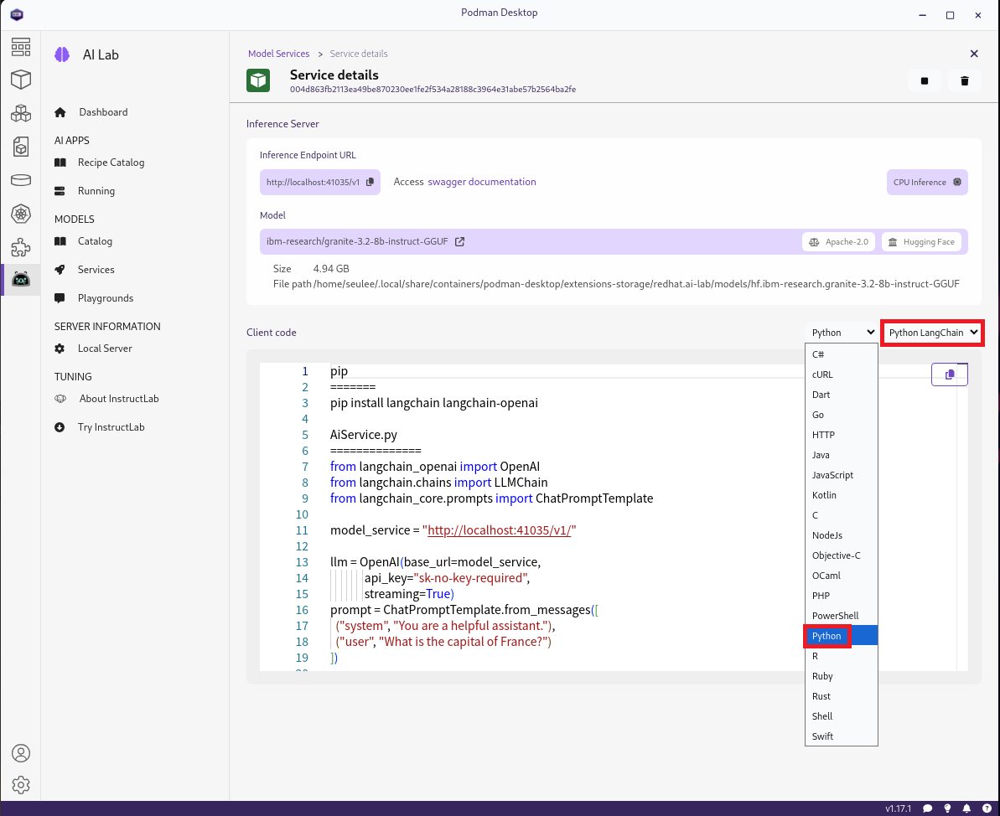
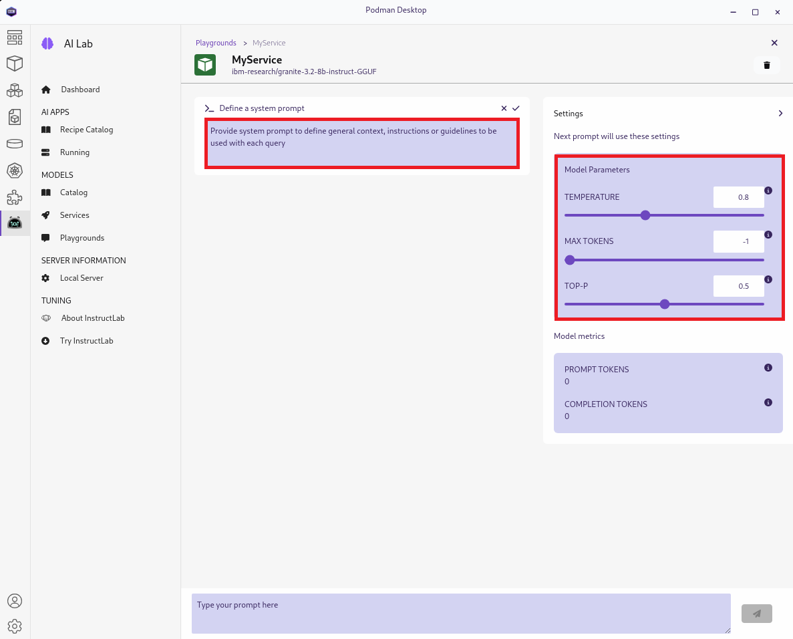

# 클라이언트 앱과 모델 연결

**차례**
1. 텍스트
2. 텍스트
3. 텍스트
<br>
<br>

## 1. 사전 훈련된 LLM 사용

사전 훈련된 LLM을 사용할 때, 자연어를 사용하여 LLM의 동작을 사용 사례에 맞게 조정 가능할 수 있습니다.
* LLM에 무엇을 해야 하는지 설명
* 어떻게 해야 하는지에 대한 맥락을 제공
* LLM에 응답에 필요한 톤이나 형식을 알림
<br>
<br>

## 2. 프롬프트 엔진니어링

### 2.1 개요

* 쓰기 기법과 텍스트 패턴을 사용하여 LLM이 작업을 수행하도록 전문화하는 것
* LLM의 동작을 변경하는 가장 간단하고 저렴한 방법

#### 1.1.1 프롬프트

* LLM에 대한 지침이나 질문이 포함된 텍스트 메시지
* 시스템 메시지나 시스템 프롬프트를 사용하여 LLM이 특정 방식으로 응답하도록 연결
* 시스템 메시지는 대화를 시작할 때 한 번 제공하는 프롬프트이며 이후 상호 작용을 위해 LLM을 구성

#### 1.1.2 프롬프트의 일반적인 구성 요소

* 명확한 작업 설명 또는 질문
* 모델이 작업을 수행하는 데 도움이 되는 상황 정보
* 모델이 처리할 입력 데이터
* 톤이나 형식과 같은 출력 지침
<br>

### 2.2 프롬프트 예

```
고대 그리스 철학의 맥락에서 #1
다음 인용문에 대한 설명을 제공하세요. #2

"나는 아테네인도 아니고 그리스인도 아니지만, 세계 시민입니다." #3

설명은 짧고 이해하기 쉬워야 합니다. #4
```
1. 맥락 정보
2. 과제 (태스크)
3. 입력 정보
4. 출력 지침

> [!NOTE]
> LLM은 비결정적이므로 LLM이 프롬프트의 지시를 완벽하게 따르지 않거나 거짓 진술이나 환각을 생성할 가능성이 있습니다. LLM은 아키텍처, 훈련 데이터 및 훈련 프로세스가 다릅니다.<br>
> <br>
> 따라서 동일한 프롬프트 엔지니어링 기술이 다른 모델에서 다르게 수행될 수 있습니다. 프롬프트 엔지니어링이 잘 수행되지 않으면 벡터 데이터베이스와 검색 증강 생성(RAG) 아키텍처를 사용하거나 모델을 미세 조정하여 프롬프트의 컨텍스트 정보를 개선하는 것을 살펴볼 수 있습니다.
<br>

### 2.3 프롬프트를 정의한는 일반적인 패턴

#### 2.3.1 Persona Pattern 

* 모델에 역할을 채택하거나 특정 페르소나로 행동하도록 지시하여 LLM과의 상호 작용을 더 잘 맥락화
  + 예를 들어, *"당신은 전문 해양 생물학자입니다…​"*라고 하면 모델이 특정 지식과 어조를 사용
* 또한 페르소나를 사용하여 프롬프트의 대상을 맥락화
  + 예를 들어, *"제가 5살인 것처럼 설명해 주세요…​"*와 같은 문장은 모델이 명확하고 기술적이지 않은 응답을 생성하도록 안내

#### 2.3.2 Zero-shot / Few-shot prompts

프롬프트가 원하는 응답의 예를 제공하는지 여부
* Few-shot 프롬프트
  + 하나 이상의 예를 제공
  + LLM은 이를 일반화하여 새로운 작업을 수행하는 능력과 결합
* Zero-shot 프롬프트
  + 모델의 지식만 사용
  + 이 때문에 예가 없음
  
프롬프트 예 - LLM에 텍스트에서 특정 형식의 JSON으로 정보를 추출하는 방법을 알려줌
```
입력 문장이 주어지면 다음 형식의 JSON 객체를 생성합니다.
{"이름": "사람 이름", 취미: ["취미1", "취미2", ...]}

예: "영희는 하이킹, 음악, 고양이를 좋아합니다."
출력: {"이름": "영희", 취미: ["하이킹", "음악", "고양이"]}
예: "철수는 달리기를 좋아하지만 헬스장은 좋아하지 않습니다."
출력: {"이름": "철수", 취미: ["달리기"]}
```

#### 2.3.3 Chain of Thought (CoT)

**CoT 기술**
* LLM이 해결책을 찾을 수 있도록 잘 설명된 단계가 있는 샘플 문제를 제공
* 과제를 해결하기 위한 모델을 보여줌
* LLM이 일반적으로 어려움을 겪는 기본 산술 계산과 같은 구조화된 문제에 유용

CoT 예
```
주어진 옵션에서 목적지까지 가장 빠른 경로를 계산합니다.

옵션 A: 2시간 비행을 타고 55분 동안 걷습니다.
옵션 B: 6시간 기차를 타고 15분 동안 걷습니다.

경로를 선택하는 단계:
1. 모든 옵션의 시간 단위를 분으로 변환합니다.
2. 옵션의 분을 더합니다.
3. 분 수가 적은 옵션을 반환합니다.
```
* 이전 예시의 지침을 제거하면 모델은 가장 높은 번호의 옵션을 가장 느린 옵션으로 간주하여 옵션 B를 선택할 수 있음

#### 2.3.4 Prompt Format Patterns

**LLM은 텍스트의 구조를 이해**
* 일관된 구조로 프롬프트를 구성하면 프롬프트의 성능이 향상
* 일관성을 유지하는 한 마크다운, 글머리 기호, 번호 매기기 목록 또는 기타 임의의 형식을 사용 가능

예 - 다음 원샷 프롬프트에서 모델은 Q가 예제 입력에 사용되고 A가 예제 출력에 사용된다고 추론
```
# Task:
입력 국가가 주어지면 수도 이름으로 응답하세요.
# Output format:
출력 형식으로 JSON을 사용하여 응답하세요.
# Examples:
Q: 스페인
A: {"수도": "마드리드"}
```
<br>

### 2.4 모델 하이퍼-파라미터

**하이퍼파라미터 매개변수**
* LLM에 응답 길이를 제한하거나 응답 창의성을 구성하는 매개변수를 제공하여 LLM의 동작을 수정
* 추론 프로세스에 영향을 미치고 제어하기 위해 추론 요청의 일부로 보내는 구성 값

> [!NOTE]
> 추론을 위해 LLM을 구성하는 맥락에서 하이퍼파라미터라는 용어는 머신 러닝에서 모델을 학습하는 데 사용되는 매개변수와 다른 매개변수를 말합니다.

|$\color{lime}{\texttt{시스템}}$|$\color{lime}{\texttt{IP 주소}}$|
|:---|:---|
|Temperature|생성된 출력의 다양성을 제어<br><ul><li>높은 값은 덜 일관된 출력을 생성할 위험이 있는 다양한 출력을 생성</li><li>낮은 값은 집중적이고 예측 가능한 출력을 생성</li><ul>|
|Top-p|텍스트를 생성할 때 단어 선택에 영향을 미침<br><ul><li>이 매개변수는 확률 범위에 있는 단어를 선택하는 값을 제공</li><li>예를 들어, 값 0.1은 상위 10% 확률에 있는 단어를 선택</li></ul>|
|Maximum tokens|모델이 생성할 수 있는 최대 토큰 수|
<br>
<br>

## 3. Podman AI Lab을 통한 모델 연결

### 3.1 Podman AI Lab 서비스

* 추론 엔드포인트에 액세스하기 위한 로컬 URL을 제공하는 컨테이너화된 추론 서버를 생성
* 원하는 서비스를 클릭하면 서비스 세부 정보 섹션에서 서비스 URL을 얻을 수 있음
* 서비스 세부 정보 섹션에서 서비스가 사용하는 모델, 서버 URL 및 다양한 언어로 AI 애플리케이션을 부트스트랩하는 데 도움이 되는 예제 클라이언트 코드 제공
  
<br>

### 3.2 LangChain을 이용한 파인썬 코드

```py
pip
=======
pip install langchain langchain-openai

AiService.py
==============
from langchain_openai import OpenAI
from langchain.chains import LLMChain
from langchain_core.prompts import ChatPromptTemplate

model_service = "http://localhost:41035/v1/"

llm = OpenAI(base_url=model_service,
             api_key="sk-no-key-required",
             streaming=True)
prompt = ChatPromptTemplate.from_messages([
  ("system", "You are a helpful assistant."),
  ("user", "What is the capital of France?")
])

chain = LLMChain(llm=llm, prompt=prompt)
response = chain.invoke({
  "messages": prompt
})
print(response)
======
```
<br>

### 3.3 Playgrounds로 LLM 테스트하기

Podman AI Lab의 플레이그라운드
* LLM, 프롬프트 및 하이퍼파라미터를 실험하는 데 사용할 수 있는 채팅 애플리케이션
* 플레이그라운드 생성
  1. Playgrounds 섹션
  2. New Playground를 클릭하여 카탈로그에서 사용 가능한 모델에서 Playground를 생성
  3. New Playground 환경 양식이 열리고 Playground 이름을 지정하고 다운로드하거나 가져온 모델 중 하나를 선택
  4. Create Playground를 클릭하면 Podman AI Lab에서 해당 모델에 대한 Playground 서비스를 생성
* 마지막으로 Playground를 열고 실험을 시작
  
  + 시스템 프롬프트를 추가하려면 Edit system prompt 아이콘을 클릭
  + TEMPERATURE, MAX TOKENS 및 TOP-P 하이퍼파라미터를 구성 가능

> [!NOTE]
> 사용자 메시지를 보낸 후에는 시스템 프롬프트를 편집할 수 없습니다. 다른 시스템 프롬프트를 사용하려면 다른 플레이그라운드를 만들어야 합니다.
<br>
<br>

## 4. LangChain을 통한 LLM 연결

### 4.1 *LangChain*

**LangChain**
* LLM을 사용하는 애플리케이션을 만드는 데 사용할 수 있는 주요 프레임워크 중 하나
* 지원 프로그래밍 언어
  + 공식적으로 Python과 JavaScript를 지원
  + Java용 langchain4j와 같은 다른 언어로의 포팅이 있음
* 언어 처리 애플리케이션에서 일반적인 구성 요소 모음으로 설계됨
<br>

### 4.2 메시지(Messages)

#### 4.2.1 모델 입력

* 일부 LangChain 모델은 입력으로 문자열을 허용
* 다른 모델은 통신을 위해 메시지 객체를 사용
  + LangChain은 *SystemMessage*, *UserMessage* 또는 *AIMessage*와 같은 다양한 유형의 메시지를 제공

#### 4.2.2 파이썬 코드 예

```py
from langchain_core.messages import HumanMessage, SystemMessage

messages = [
    SystemMessage(content="You are a helpful assistant."),
    HumanMessage(content="What is your name?"),
    AIMessage(content="My name is Tom")
]
```

#### 4.2.3 튜플 목록으로 정의된 메시지

LangChain 구성 요소는 다음과 같은 튜플 목록으로 정의된 메시지도 허용
```py
messages = [
    ("system", "You are a helpful assistant."),
    ("user", "What is your name?"),
    ("assistant", "My name is Alice")
]
```
<br>

### 4.3 프롬프트 템플림 (Prompt Templates)

#### 4.3.1 프롬프트 템플릿이란

* 프롬프트 내부의 프롬프트 변수를 프로그래밍 방식으로 대체하기 위한 템플릿

#### 4.3.2 프롬프트 변수를 정의

* 프롬프트 텍스트에서 변수 이름을 중괄호로 묶음
* 문자열이 있는 *PromptTemplate* 클래스를 사용하거나 메시지 목록이 있는 *ChatPromptTemplate*을 사용하여 프롬프트를 생성
  + 이러한 클래스 중 하나에서 *invoke*를 호출
  + LangChain 모델의 일반적인 입력 유형인 *PromptValue*가 생성
* 템플릿 클래스의 *invoke* 메서드는 사전(딕셔너리)을 입력으로 사용
  + 사전 키(key)는 대체할 변수
  + 사전 값(values)은 최종 프롬프트 텍스트에 표시되는 것

#### 4.3.3 문자열에서 프롬프트 템플릿을 사용하는 예제

```py
from langchain_core.prompts import PromptTemplate

template_string = PromptTemplate.from_template(
    "Translate \"Where is the airport?\" to {language}"
)
prompt_value = prompt_template.invoke({"language": "French"})
```

> [!NOTE]
> *invoke* 메서드는 LangChain 구성 요소를 실행하는 주요 방법 중 하나입니다. 각 구성 요소에는 고유한 *invoke* 구현이 있습니다.<br>
> <br>
> LangChain은 구성 요소를 실행 가능한 구성 요소로 설계합니다. 이러한 모든 구성 요소는 *invoke* 또는 *batch*와 같은 메서드를 구현합니다. 공통 API를 공유하면 구성 요소 사용이 간소화되고 이 섹션의 끝에서 설명하는 구성 요소 체이닝과 같은 추가 이점이 제공됩니다.

#### 4.3.4 메시지 목록에서 프롬프트 템플릿을 사용하는 예제

```py
from langchain_core.prompts import ChatPromptTemplate

prompt_template = ChatPromptTemplate.from_messages([
    ("system", "You are a {language} translator."),
    ("user", "Where is the airport?")
])
prompt_value = prompt_template.invoke({"language": "French"})
```
<br>

### 4.4 모델 (Models)

LangChain 모델 클래스는 많은 모델 공급자와의 통합을 제공

#### 4.4.1 OpenAI API와 간단한 통합을 만드는 OpenAI 클래스를 사용하는 예제

```py
from langchain_openai import OpenAI

llm = OpenAI(base_url="https://...", api_key="...", temperature=0.5) #1 
string_response = llm.invoke("Tell me a joke") #2
```
1. 모델 객체를 만듦
   + 구성 매개변수와 하이퍼 매개변수를 전달
2. 텍스트 문자열을 전달하여 모델을 실행
   + 출력도 텍스트 문자열로 반환

> [!NOTE]
> Podman AI Lab에서 사용 가능한 많은 모델은 OpenAI API와 호환되는 *llama.cpp* HTTP 서버를 사용합니다. 즉, LangChain의 OpenAI 클래스를 사용하여 이러한 로컬 모델을 사용할 수 있습니다. 이렇게 하려면 다음과 같이 *base_url* 매개변수를 제공합니다.
> ```
> OpenAI(base_url="http://localhost:PORT", api_key="not-needed", ...)
> ```

#### 4.4.2 Chat Models

LangChain은 모델 클래스 위에 Chat Models라는 추가 추상화를 제공
* Chat 모델은 채팅 애플리케이션에 맞게 조정된 보다 정교한 API를 제공
* 텍스트 문자열을 입력 및 출력으로 사용하는 대신, 채팅 모델은 메시지 객체를 사용
  + 메시지 목록을 입력으로 받고 *AssistantMessage*를 출력으로 생성
* 예를 들어, OpenAI로 간단한 채팅 애플리케이션을 만들려면 다음과 같이 *ChatOpenAI* 클래스를 사용 가능
  ```py
  from langchain_openai import ChatOpenAI
  
  llm = ChatOpenAI(base_url="http://localhost:PORT", ...) #1
  messages = [
      ("system", "You are a Java assistant that implements methods."), #2
      ("human", "Create a method to sort a list of dates"),
  ]
  ai_msg = llm.invoke(messages) #3
  ```
  1. 채팅 모델 객체를 만듦
  2. 메시지 목록을 정의
     + 메시지 객체나 튜플로 정의
  3. 모델 실행

> [!NOTE]
> LangChain은 채팅이 아닌 사용 사례에도 채팅 모델 클래스를 사용할 것을 권장합니다.
<br>

### 4.5 출력 파서 (Output Parsers)

일반적으로 텍스트나 메시지 형태로 모델이 생성하는 출력을 받아서 다른 형식으로 변환

JSON 파서가 보조 메시지를 받아서 JSON 사전으로 변환 예제
```py
from langchain_core.output_parsers import JsonOutputParser

...<snip>...

messages = [...]
ai_msg = llm.invoke(messages)
parser = JsonOutputParser()
json_dict = parser.invoke(ai_msg)

...<snip>...
```
<br>

### 4.6 Chains과 LCEL

**Chains**
* 복잡한 작업을 수행하기 위해 함께 배치하는 LangChain 구성 요소의 시퀀스
* 체인을 구성하여 복잡한 워크플로 생성
* 모든 구성 요소의 출력은 다음 체인 구성 요소의 입력으로 전달
* 따라서 구성 요소의 출력 유형은 다음 구성 요소의 입력 유형과 호환

**LangChain Expression Language (LCEL)**
* 체인을 만드는 선언적 방법
* Python에서 LCEL을 사용하여 다음 예와 같이 파이프 기호(|)로 LangChain 구성 요소를 구분하여 체인을 생성
  ```py
  prompt_template = ChatPromptTemplate.from_messages([
      ("system", "You are a {language} translator."),
      ("user", "Where is the airport?")
  ])
  llm = ChatOpenAI(base_url="...")
  chain = prompt_template | llm | JsonOutputParser()
  json_dict = chain.invoke({"language": "French"})
  ```
<br>
<br>

------
[차례](../README.md)


