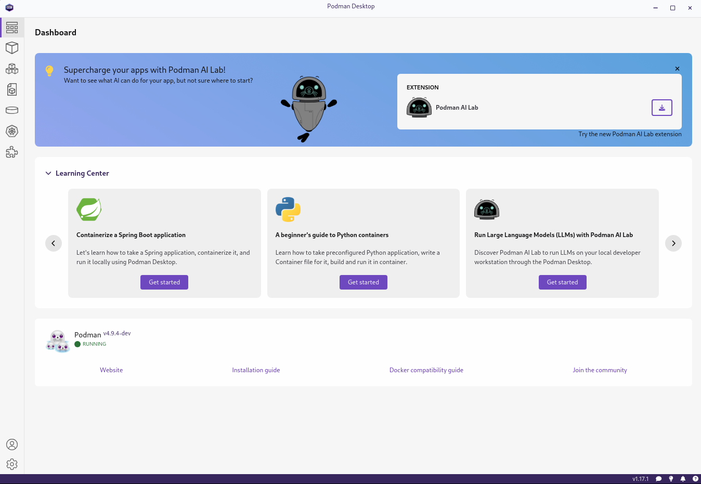
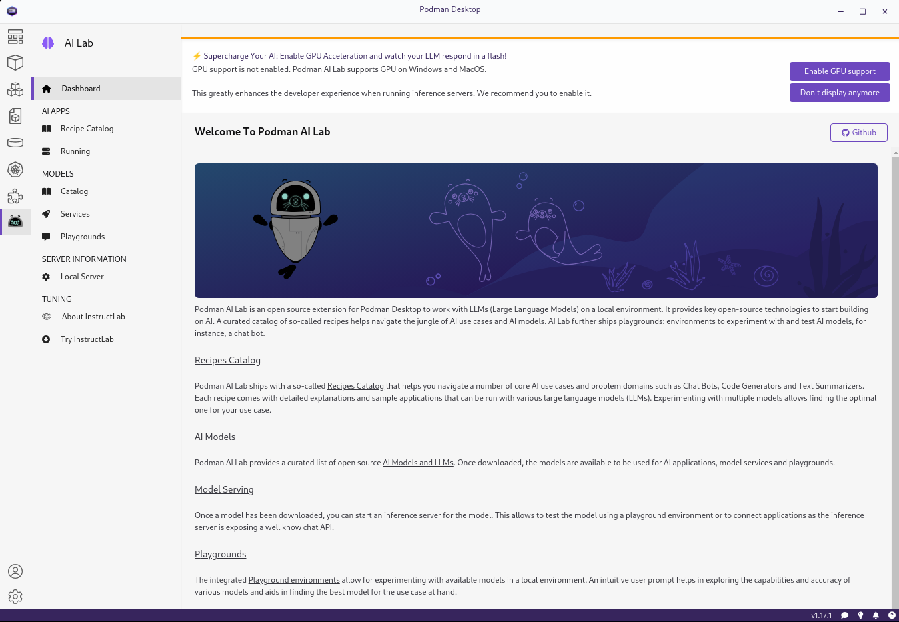
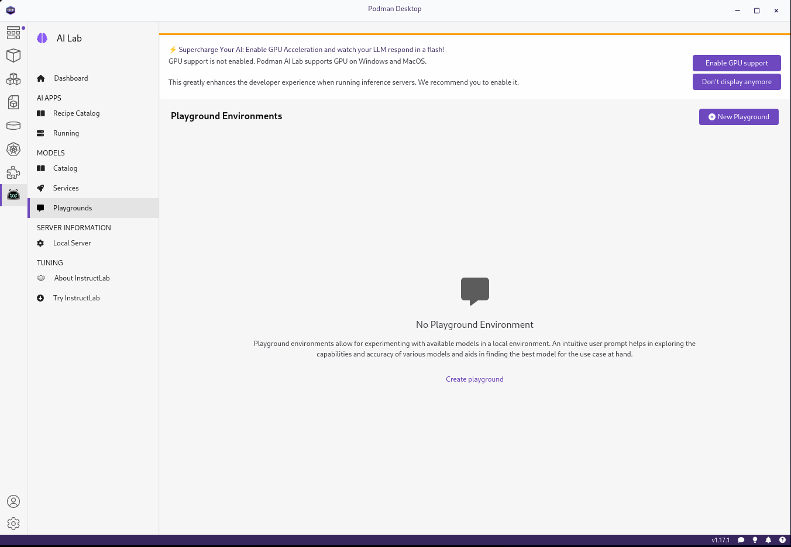
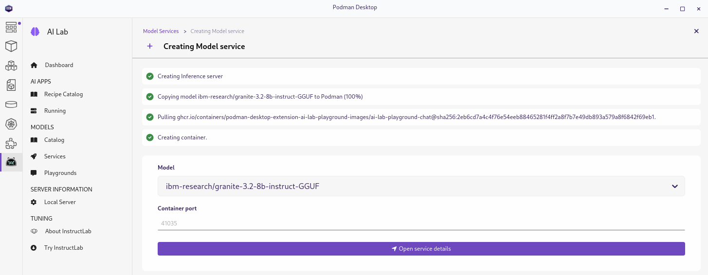
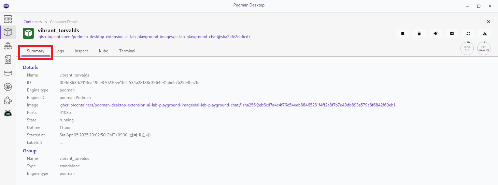
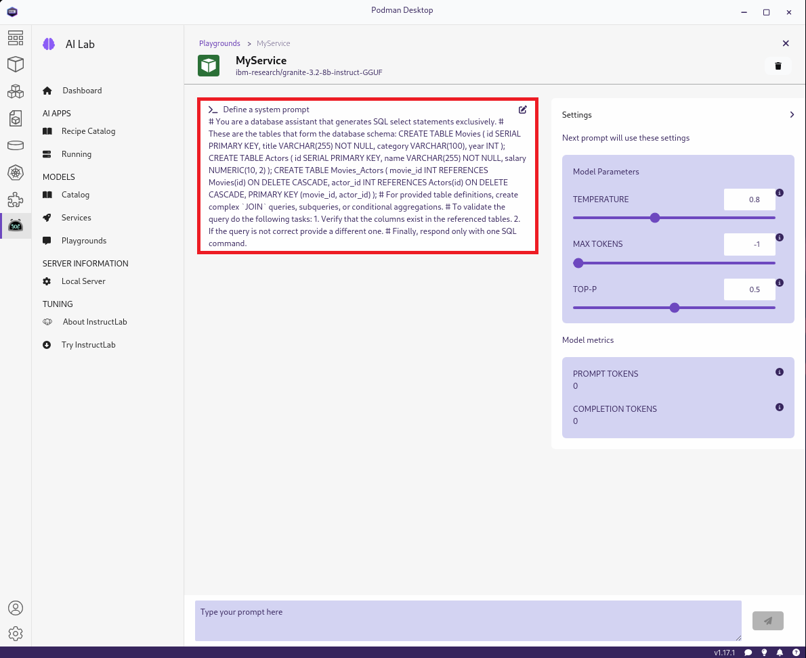
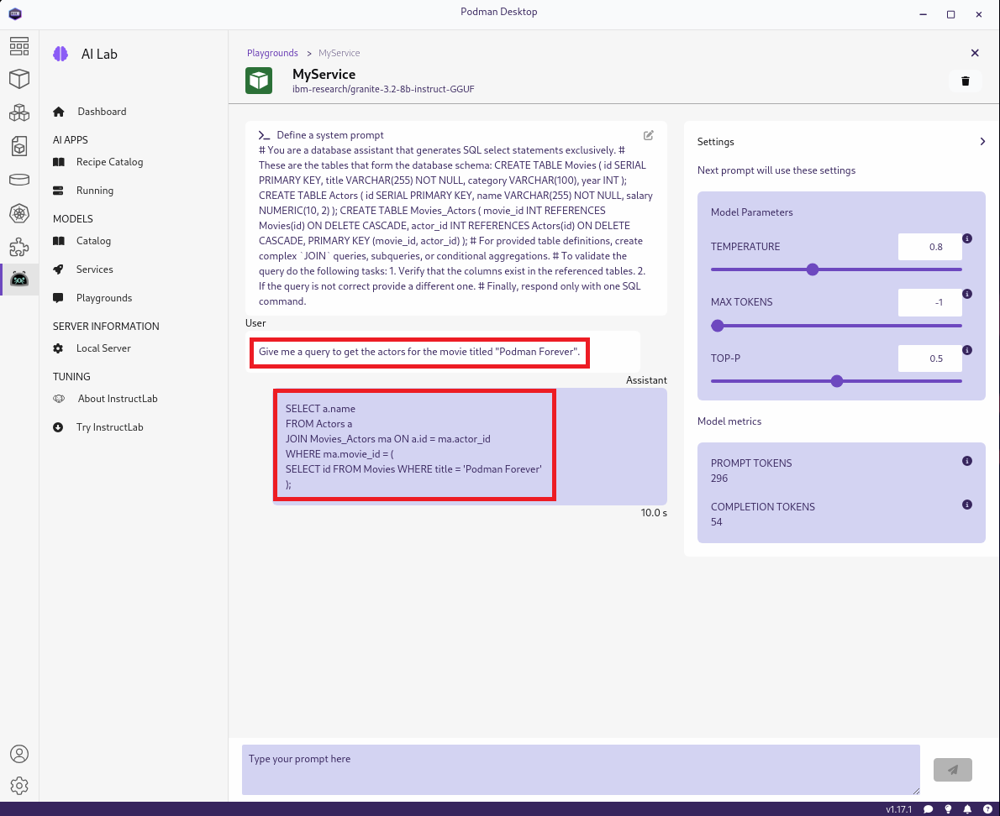

# Podman Desktop 

**차례**
1. [RHEL에 Podman Desktop 설치 및 구성](podman_desktop_with_ai_model.md#1-rhel에-podman-desktop-설치-및-구성)
2. [Podman AI Lab](podman_desktop_with_ai_model.md#2-podman-ai-lab)
3. [클라이언트 연결](podman_desktop_with_ai_model.md#3-클라이언트-연결)
<br>
<br>


## 1. RHEL에 Podman-Desktop 설치 및 구성

### 1.1 RHEL 구성 및 설치 준비

#### 1.1.1 리포지토리 설정

실행 명령어
```bash
subscription-manager repos --enable codeready-builder-for-rhel-9-$(arch)-rpms
dnf install https://dl.fedoraproject.org/pub/epel/epel-release-latest-9.noarch.rpm
```

실행 결과
```
[root@rhel94-pd ~]# subscription-manager repos --enable codeready-builder-for-rhel-9-$(arch)-rpms

[root@rhel94-pd ~]# dnf install https://dl.fedoraproject.org/pub/epel/epel-release-latest-9.noarch.rpm

...<snip>...

[root@rhel94-pd ~]#
```

#### 1.1.2 RDP 설치 및 구성

실행 명령어
```bash
dnf search xrdp
dnf install -y xrdp
```

실행 결과
```
[root@rhel94-pd ~]# dnf search xrdp
서브스크립션 관리 저장소를 최신화하기.
마지막 메타자료 만료확인(0:00:53 이전): 2025년 04월 05일 (토) 오후 04시 44분 14초.
========================= 이름과 정확히 일치하는 항목: xrdp =========================
xrdp.x86_64 : Open source remote desktop protocol (RDP) server
========================= 이름 & 요약과 일치하는 항목: xrdp =========================
xorgxrdp.x86_64 : Implementation of xrdp backend as Xorg modules
xorgxrdp-glamor.x86_64 : Implementation of xrdp backend as Xorg modules with glamor
xrdp-devel.x86_64 : Headers and pkg-config files needed to compile xrdp backends
xrdp-selinux.x86_64 : SELinux policy module required tu run xrdp

[root@rhel94-pd ~]# dnf install -y xrdp

...<snip>...

[root@rhel94-pd ~]#
```

#### 1.1.3 방화벽 설정

실행 명령어
```bash
sudo firewall-cmd --add-port=3386/tcp --permanent
sudo firewall-cmd --reload
```

실행 결과
```
[root@rhel94-pd ~]# sudo firewall-cmd --add-port=3386/tcp --permanent
success

[root@rhel94-pd ~]# sudo firewall-cmd --reload
success

[root@rhel94-pd ~]#
```

#### 1.1.4 RDP 서비스 시작 및 활성화

실행 명령어
```bash
systemctl enable xrdp
systemctl start xrdp
```

실행 결과
```
[root@rhel94-pd ~]# systemctl enable xrdp
Created symlink /etc/systemd/system/multi-user.target.wants/xrdp.service → /usr/lib/systemd/system/xrdp.service.

[root@rhel94-pd ~]# systemctl start xrdp

[root@rhel94-pd ~]#
```
<br>

### 1.2 Podman-Desktop 설치

#### 1.2.1 *FlatHub* 리포지토리 추가 및 활성화

실행 결과
```bash
flatpak remote-add --if-not-exists --user flathub https://flathub.org/repo/flathub.flatpakrepo
```

실행 명령어
```
[root@rhel94-pd ~]# flatpak remote-add --if-not-exists --user flathub https://flathub.org/repo/flathub.flatpakrepo

[root@rhel94-pd ~]#
```

#### 1.2.2 Podman Desktop 설치

실행 명령어
```bash
flatpak install --user flathub io.podman_desktop.PodmanDesktop
```

실행 결과
```
[root@rhel94-pd ~]# flatpak install --user flathub io.podman_desktop.PodmanDesktop
Looking for matches…
Required runtime for io.podman_desktop.PodmanDesktop/x86_64/stable (runtime/org.freedesktop.Platform/x86_64/24.08) found in remote flathub
Do you want to install it? [Y/n]: y

io.podman_desktop.PodmanDesktop permissions:
    ipc                   network              x11      dri
    file access [1]       dbus access [2]

    [1] /run/docker.sock, home, xdg-run/containers/auth.json, xdg-run/podman:create
    [2] org.freedesktop.Flatpak, org.freedesktop.Notifications,
        org.freedesktop.secrets, org.kde.StatusNotifierWatcher, org.kde.kwalletd6


        ID                                  Branch     Op Remote  Download
 1. [✓] org.freedesktop.Platform.GL.default 24.08      i  flathub 156.3 MB / 156.8 MB
 2. [✓] org.freedesktop.Platform.GL.default 24.08extra i  flathub  25.2 MB / 156.8 MB
 3. [✓] org.freedesktop.Platform.Locale     24.08      i  flathub   2.4 MB / 380.4 MB
 4. [✓] org.freedesktop.Platform.openh264   2.5.1      i  flathub 913.7 kB / 971.4 kB
 5. [✓] org.freedesktop.Platform            24.08      i  flathub 210.8 MB / 264.5 MB
 6. [✓] io.podman_desktop.PodmanDesktop     stable     i  flathub 133.6 MB / 140.0 MB

Installation complete.

[root@rhel94-pd ~]#
```

#### 1.2.3 Podman-Desktop 설치 확인

실행 명령어
```bash
flatpak run io.podman_desktop.PodmanDesktop --no-sandbox
```

실행 결과
```
[root@rhel94-pd ~]# flatpak run io.podman_desktop.PodmanDesktop
[0405/171736.869730:FATAL:electron_main_delegate.cc(288)] Running as root without --no-sandbox is not supported. See https://crbug.com/638180.
/app/bin/run.sh: 줄 3:     3 추적/중단점 함정 (코어 덤프됨) zypak-wrapper.sh /app/main/podman-desktop "$@"

[root@rhel94-pd ~]# flatpak run io.podman_desktop.PodmanDesktop --no-sandbox
[3:0405/171812.944298:ERROR:bus.cc(407)] Failed to connect to the bus: Failed to connect to socket /run/dbus/system_bus_socket: 그런 파일이나 디렉터리가 없습니다
Gtk-Message: 17:18:13.807: Failed to load module "canberra-gtk-module"
Gtk-Message: 17:18:13.807: Failed to load module "pk-gtk-module"
Gtk-Message: 17:18:13.809: Failed to load module "canberra-gtk-module"
Gtk-Message: 17:18:13.809: Failed to load module "pk-gtk-module"

...<snip>...

Activating extension (podman-desktop.podman) ended in 437 milliseconds
Activating extension (podman-desktop.registries) with max activation time of 20 seconds
Activating extension (podman-desktop.registries) ended in 1 milliseconds
PluginSystem: initialization done.
Autostarting podman-desktop.podman container engine
[kind] kind extension is active
[kind] kind extension is active
[podman] Podman extension: Could not find the socket at /run/user/0/podman/podman.sock after 5s. The command podman system service --time=0 did not work to start the podman socket.

[root@rhel94-pd ~]#
```

#### 1.2.4 Podman-Desktop 실행 확인

</img>
<br>
<br>

## 2. Podman AI Lab

### 2.1 Podman AI Extension 설치

#### 2.1.1 AI Lab 설치

포드맨 AI 랩 설치 후 확인

</img>

#### 2.1.2 AI 랩의 **Catalog** 

다운로드하여 실행할 수 있는 모델 목록
</img>

* 포드맨 AI Lab에는 기본적으로 여러 개의 오픈 소스 모델이 포함
* 이러한 모델의 대부분은 GGUF 형식으로 양자화되어 워크스테이션에서 실행 가능
* 카탈로그에 자체 모델을 가져올 수도 있음

#### 2.1.3 AI 랩의 **Services**

모델을 실행하려면 먼저 모델을 다운로드한 다음 서비스를 만들어야 함
</img>

* 모델 서비스는 추론 서버를 실행하는 컨테이너
* 이 서버는 모델을 실행하고 노출
* 모델은 필요한 서비스를 지시
  + 예를 들어, 모든 GGUF 모델은 llama.cpp 서비스를 사용
  + 서비스 섹션에는 만든 서비스가 나열

> [!NOTE]
> 포드맨 AI 랩은 아직 ResNet을 위한 서비스를 제공하지 않음

#### 2.1.4 AI 랩의 **Playgrouds**

Playgroud는 Podman Desktop에 내장된 채팅 창
</img>

* 이를 통해 서비스에 연결하고 모델을 실험 가능
* Podman AI의 *playgroud* 섹션에는 사용자가 만든 놀이터가 나열

> [!NOTE]
> 포드맨 AI는, 또한, UI를 포함한 AI 앱 생성을 위한 템플릿인 레시피를 제공합니다.
<br>
<br>

### 2.2 모델 관리

#### 2.2.1 모델 다운로드

</img>

*  ~/.local/share/containers/podman-desktop/extensions-storage/redhat.ai-lab/models에 다운로드
* 기본 카탈로그에 포함된 대부분의 모델은 GGUF 형식의 양자화된 LLM
* ResNet과 같은 다른 기본 모델은 LLM이 아니며 PyTorch와 같은 다른 형식으로 다운로드
* 모델 파일을 다운로드한 후 모델 서비스를 만들거나 파일 시스템에서 모델 파일을 볼 수 있음

#### 2.2.2 다운로드한 모델 확인

실행 명령어
```bash
tree -F .local/share/containers/podman-desktop/extensions-storage/redhat.ai-lab/
```

실행 결과
```
[root@rhel94-pd ~]# tree -F .local/share/containers/podman-desktop/extensions-storage/redhat.ai-lab/
.local/share/containers/podman-desktop/extensions-storage/redhat.ai-lab/
└── models/
    └── hf.ibm-research.granite-3.2-8b-instruct-GGUF/
        └── granite-3.2-8b-instruct-Q4_K_M.gguf

2 directories, 1 file

[root@rhel94-pd ~]# 
```

#### 2.2.3 모델 실행

**다운로드한 LLM 실행을 위해 서비스 생성**
</img>

* 다운로드한 모델에서 ***Create Model Service(rocket)*** 버튼을 클릭하여 서비스를 만듦
* 또는 AI Lab 메뉴에서 Services를 클릭한 다음 New Model Service를 클릭하고 배포하려는 모델을 선택
* Podman AI Lab은 모델에 필요한 서비스 유형을 자동으로 선택
* GGUF 형식의 LLM은 llama.cpp 서비스 백엔드를 사용
  + 이 서비스를 실행하기 위해 Podman Desktop은 ghcr.io/containers/llamacpp_python 이미지로 컨테이너를 만들고 컨테이너의 /models 디렉터리에 모델 파일을 마운트
  + 이 컨테이너는 마운트된 모델을 실행하고 OpenAI 호환 API를 통해 노출하는 llama.cpp HTTP 서버를 실행

**생성된 모델 확인**
</img>

#### 2.2.4 모델 리스트 확인

</img>

#### 2.2.5 모델 테스트

실행 명령어
```bash
curl --location 'http://localhost:41035/v1/chat/completions' --header 'Content-Type: application/json' --data '{
  "messages": [
    {
      "content": "You are a helpful assistant.",
      "role": "system"
    },
    {
      "content": "What is the capital of France?",
      "role": "user"
    }
  ]
}' | jq '.'
```

실행 결과
```
[seulee@rhel94-pd ~]$ curl --location 'http://localhost:41035/v1/chat/completions' --header 'Content-Type: application/json' --data '{
  "messages": [
    {
      "content": "You are a helpful assistant.",
      "role": "system"
    },
    {
      "content": "What is the capital of France?",
      "role": "user"
    }
  ]
}' | jq '.'
  % Total    % Received % Xferd  Average Speed   Time    Time     Time  Current
                                 Dload  Upload   Total   Spent    Left  Speed
100   557  100   365  100   192    200    105  0:00:01  0:00:01 --:--:--   305
{
  "id": "chatcmpl-10b2d8b4-51c7-4ec2-b8f1-a4f64fec7a02",
  "object": "chat.completion",
  "created": 1743851990,
  "model": "/models/granite-3.2-8b-instruct-Q4_K_M.gguf",
  "choices": [
    {
      "index": 0,
      "message": {
        "content": "\nThe capital of France is Paris.",
        "role": "assistant"
      },
      "logprobs": null,
      "finish_reason": "stop"
    }
  ],
  "usage": {
    "prompt_tokens": 60,
    "completion_tokens": 9,
    "total_tokens": 69
  }
}

[seulee@rhel94-pd ~]$ 
```

JSON 질의
```json
{
  "messages": [
    {
      "content": "You are a helpful assistant.",
      "role": "system"
    },
    {
      "content": "What is the capital of France?",
      "role": "user"
    }
  ]
}
```

JSON 응답
```json
{
  "id": "chatcmpl-10b2d8b4-51c7-4ec2-b8f1-a4f64fec7a02",
  "object": "chat.completion",
  "created": 1743851990,
  "model": "/models/granite-3.2-8b-instruct-Q4_K_M.gguf",
  "choices": [
    {
      "index": 0,
      "message": {
        "content": "\nThe capital of France is Paris.",
        "role": "assistant"
      },
      "logprobs": null,
      "finish_reason": "stop"
    }
  ],
  "usage": {
    "prompt_tokens": 60,
    "completion_tokens": 9,
    "total_tokens": 69
  }
}
```

### 2.3 모델 서비스 조사

**세부 정보**
</img>

* 서비스 세부 정보 열기를 클릭하여 확인
* 서비스 세부 정보 페이지는 컨테이너 ID, 엔드포인트, 서비스가 실행 중인 모델과 같은 기본 정보를 제공
* 서비스에 요청을 하려면 선택한 언어로 예제 코드를 복사하여 실행
* ***Inference Endpoint URL***: 추론 모델 서비스 엔드포인트 URL
<br>

### 2.4 플레이그라운드

#### 2.4.1 플레이그라운드 생성

</img>

* 제공된 코드를 사용하지 않으려면 플레이그라운드를 만들어 모델 서비스를 테스트할 수 있음
  + 플레이그라운드를 만들려면 플레이그라운드를 클릭한 다음 새 플레이그라운드를 클릭
  + 플레이그라운드는 모델과 상호 작용하는 데 사용할 수 있는 채팅 인터페이스를 제공

#### 2.4.2 플레이그라운드 리스트

</img>

#### 2.4.3 플레이그라운드 테스트

</img>

<br>

### 2.5 모델 서비스 모니터링

#### 2.5.1 컨테이너 리스트

</img>

#### 2.5.2 해당 컨테이너의 요약

</img>

#### 2.5.3 컨테이너 앱 YAML

</img>
<br>

### 2.6 CLI에서 모델 서비스 모니터링

실행 명령어
```bash
podman stats
```

실행 결과
```
[student@workstation ~]$ podman stats
ID            NAME                CPU %       MEM USAGE / LIMIT  MEM %       NET IO            BLOCK IO    PIDS        CPU TIME    AVG CPU %
32aa84fe4b86  mystifying_faraday  0.55%       383.1MB / 16.5GB   2.32%       2.62kB / 1.258kB  0B / 0B     5           40.193812s  0.55%
^C

[student@workstation ~]$ 
```

> [!NOTE]
> 이 수준의 리소스 사용은 LLM에 비해 현저히 낮습니다.<br>
> <br>
> 양자화된 모델을 사용하면 리소스 소비를 낮추고 리소스가 제한된 환경에서 모델을 실행할 수 있습니다. 예를 들어, granite-7b-base 비양자화 버전은 동일한 시나리오에서 최대 30GB를 소비할 수 있습니다.
<br>
<br>

## 3. 클라이언트 연결

### 3.1 프롬프트 사용

#### 3.1.1 프롬프트를 위한 콘텐츠

예) 프롬포트를 위한 SQL 콘텐츠
```sql
# You are a database assistant that generates SQL select statements exclusively.

# These are the tables that form the database schema:

CREATE TABLE Movies (
    id SERIAL PRIMARY KEY,
    title VARCHAR(255) NOT NULL,
    category VARCHAR(100),
    year INT
);

CREATE TABLE Actors (
    id SERIAL PRIMARY KEY,
    name VARCHAR(255) NOT NULL,
    salary NUMERIC(10, 2)
);

CREATE TABLE Movies_Actors (
    movie_id INT REFERENCES Movies(id) ON DELETE CASCADE,
    actor_id INT REFERENCES Actors(id) ON DELETE CASCADE,
    PRIMARY KEY (movie_id, actor_id)
);

# For provided table definitions, create complex `JOIN` queries, subqueries, or conditional aggregations.

# To validate the query do the following tasks:
1. Verify that the columns exist in the referenced tables.
2. If the query is not correct provide a different one.

# Finally, respond only with one SQL command.
```

#### 3.1.2 프롬프트에 입력 후 체크



1. 포드맨 데스크탑의 플레이그라운드에서 *Edit system prompt*를 클릭
2. ***>_Define a system prompt*** 필드에 콘텐츠를 입력
3. *checkmark*를 클릭

#### 3.1.3 질의 입력



1. *Type your prompt here*에 다음 질문 입력
   ```
   Give me a query to get the actors for the movie titled "Podman Forever".
   ```
2. 시간이 걸리지만 SQL 명령어를 설명하는 응답을 제공함
<br>

### 3.2 모델 서비스에 질의 및 응답

#### 3.2.1 **~/model-query** 폴더 및 파일 리스트

[~/model-query](./src/model-query/) 폴더
```
[seulee@rhel94-pd ~]$ tree -F model-query/
app/
├── assistant.py
├── config.py
├── database.py
├── main.py
└── requirements.txt

1 directory, 5 files

[seulee@rhel94-pd ~]$
```

#### 3.2.2 **~/model-query/main.py** 주요 내용

[~/model-query/main.py](./src/model-query/main.py)
```py
query = generate_query(user_input) #1
click.secho(query, fg="cyan", italic=True)
result = run_query(query)
click.echo(result) #2
```
1. 사용자 요청을 읽고, SQL 문을 생성하는 *generate_query()*를 호출
2. SQL 문 실행을 위해 *run_query()*를 호출

#### 3.2.3 **~/model-query/assistant.py** 주요 내용

[~/model-query/assistant.py](./src/model-query/assistant.py)
```py
llm = OpenAI(base_url=model_url, api_key="not-needed", temperature=0.1) #1
prompt_template = PromptTemplate.from_template(template)

def generate_query(user_input: str):
    table_definitions = get_db_tables_schema()
    # TODO: add parameters
    prompt = prompt_template.invoke(
        {"tables": table_definitions, "user_input": user_input} #2
    )
    return llm.invoke(prompt)
```
1. **OpenAI()**에서 *base_url* 인수로 모델의 URL 전달
2. *tables*와 *user_input* 변수를 가지고 템플릿 제공

#### 3.2.4 파이썬 가상화 환경

실행 명령어
```bash
python -m venv .venv && source .venv/bin/activate
```

```실행 결과
[seulee@rhel94-pd ~]$ python -m venv .venv && source .venv/bin/activate

(.venv) [seulee@rhel94-pd ~]$
```

#### 3.2.5 필요한 패키지 설치

실행 명령어 - [~/model-query/requirements.txt](./src/model-query/requirements.txt)
```bash
pip install -r model-query/requirements.txt
```

실행 결과
```
(.venv) [seulee@rhel94-pd ~]$ pip install -r model-inquery/requirements.txt
Defaulting to user installation because normal site-packages is not writeable
Collecting aiohappyeyeballs==2.4.0
  Downloading aiohappyeyeballs-2.4.0-py3-none-any.whl (12 kB)
Collecting aiohttp==3.10.5
  Downloading aiohttp-3.10.5-cp39-cp39-manylinux_2_17_x86_64.manylinux2014_x86_64.whl (1.2 MB)
     |████████████████████████████████| 1.2 MB 9.8 MB/s
Collecting aiosignal==1.3.1
  Downloading aiosignal-1.3.1-py3-none-any.whl (7.6 kB)

...<snip>...

  WARNING: Value for scheme.platlib does not match. Please report this to <https://github.com/pypa/pip/issues/10151>
  distutils: /home/seulee/.local/lib/python3.9/site-packages
  sysconfig: /home/seulee/.local/lib64/python3.9/site-packages
  WARNING: Additional context:
  user = True
  home = None
  root = None
  prefix = None
    Running setup.py install for dotenv-python ... done
Successfully installed GitPython-3.1.43 PyYAML-6.0.2 Pygments-2.18.0 SQLAlchemy-2.0.32 aiohappyeyeballs-2.4.0 
...<snip>...
typing-extensions-4.12.2 typing-inspect-0.9.0 urllib3-2.2.2 uvicorn-0.23.2 wheel-0.44.0 yarl-1.9.6

(.venv) [seulee@rhel94-pd ~]$
```

#### 3.2.6 데이터베이스 확인

실행 명령어
```bash
podman ps -a
podman start movies_db
podman ps -a
```

실행 결과
```
(.venv) [student@workstation app]$ podman ps -a
CONTAINER ID  IMAGE                                     COMMAND         CREATED      STATUS                     PORTS                   NAMES
3614639d4078  registry.redhat.io/rhel9/postgresql-13:1  run-postgresql  2 hours ago  Exited (0) 42 minutes ago  0.0.0.0:5432->5432/tcp  movies_db

(.venv) [student@workstation app]$ podman start movies_db
movies_db

(.venv) [student@workstation app]$ podman ps -a
CONTAINER ID  IMAGE                                     COMMAND         CREATED      STATUS        PORTS                   NAMES
3614639d4078  registry.redhat.io/rhel9/postgresql-13:1  run-postgresql  2 hours ago  Up 4 seconds  0.0.0.0:5432->5432/tcp  movies_db

(.venv) [student@workstation app]$ 
```

#### 3.2.7 데이터베이스 연결

실행 명령어
```bash
podman exec -it movies_db /bin/bash --
psql
\c
\list
\q
exit
```

실행 결과
```
(.venv) [student@workstation app]$ podman exec -it movies_db /bin/bash --
bash-5.1$ psql

postgres=# \c
You are now connected to database "postgres" as user "postgres".

postgres-# \list
                                 List of databases
   Name    |  Owner   | Encoding |  Collate   |   Ctype    |   Access privileges   
-----------+----------+----------+------------+------------+-----------------------
 movies    | student  | UTF8     | en_US.utf8 | en_US.utf8 | 
 postgres  | postgres | UTF8     | en_US.utf8 | en_US.utf8 | 
 template0 | postgres | UTF8     | en_US.utf8 | en_US.utf8 | =c/postgres          +
           |          |          |            |            | postgres=CTc/postgres
 template1 | postgres | UTF8     | en_US.utf8 | en_US.utf8 | =c/postgres          +
           |          |          |            |            | postgres=CTc/postgres
(4 rows)

postgres-# \q

bash-5.1$ exit
exit

(.venv) [student@workstation app]$ 
```

#### 3.2.8 데이터베이스 외부 연결

실행 명령어
```
podman exec movies_db   psql -U student -d movies   -c "SELECT title FROM Movies"
```

실행 결과
```
(.venv) [student@workstation app]$ podman exec movies_db   psql -U student -d movies   -c "SELECT title FROM Movies"
       title        
--------------------
 The Infinite Chase
 Parallel Universes
 Podman Forever
 The Silent Forest
 Quantum Paradox
(5 rows)

(.venv) [student@workstation app]$ 
```

#### 3.2.9 환경 변수 설정

실행 명령어
```bash
export MODEL_URL="http://localhost:41035/v1"
```

실행 결과
```
(.venv) [student@workstation app]$ export MODEL_URL="http://localhost:41035/v1"

(.venv) [student@workstation app]$ echo $MODEL_URL
http://localhost:41035/v1

(.venv) [student@workstation app]$ 
```

#### 3.2.10 데이터베이스에 질의 요청

실행 명령어
```bash
python main.py
Give me a list of movie titles
```

실행 결과
```
(.venv) [student@workstation app]$ python main.py
Movie Database Assistant. Type 'exit' to quit.

> Give me a list of movie titles

SELECT title FROM Movies;
+--------------------+
| title              |
+====================+
| The Infinite Chase |
+--------------------+
| Parallel Universes |
+--------------------+
| Podman Forever     |
+--------------------+
| The Silent Forest  |
+--------------------+
| Quantum Paradox    |
+--------------------+

> Give me a query to get the actors for the movie titled "Podman Forever".
SELECT Actors.name 
FROM Movies_Actors 
JOIN Movies ON Movies_Actors.movie_id = Movies.id 
JOIN Actors ON Movies_Actors.actor_id = Actors.id 
WHERE Movies.title = 'Podman Forever';
+------------+
| name       |
+============+
| Zara Quill |
+------------+
| Finn Lyric |
+------------+

> exit
Bye...

(.venv) [student@workstation app]$ 
```
* 질의에 대한 응답은 모델이 시간이 걸림

> [!NOTE]
> 사용된 모델은 특정 사용 사례에 미세 조정되지 않은 사전 학습된 코딩 LLM을 사용합니다. 예를 들어 모델이 쿼리에 소개 텍스트를 제공하거나 복잡한 조인 쿼리를 시도하는 경우 응용 프로그램이 실패할 수 있습니다.
<br>
<br>

------
[차례](../README.md)


