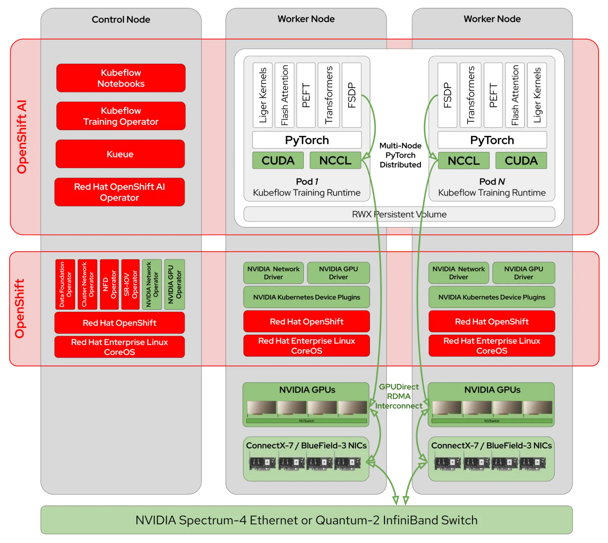

# NVidia GPUDirect RDMA를 모델 훈련 가속화

**목차**
1.  
2.  
3.  
4.  

 
 

## 1. 분산 모델 훈련

### 1.1 모델 스케일링 아웃

대규모 언어 모델(LLM)의 스케일링 아웃은 혁신의 속도를 유지하고 LLM 성능의 한계를 뛰어넘는 데 중요한 역할을 해왔으며, 이는 AI의 스케일링 법칙을 뒷받침하는 역할을 해왔습니다.

양자화나 압축과 같은 기술을 사용하여 이러한 대규모 모델을 단일 GPU에 로드하는 데 필요한 메모리 양을 줄일 수 있습니다. 하지만, 몇 가지 단점이 있으며 스케일링 아웃만이 유일한 선택지가 되게 하는 한계점을 높일 뿐입니다. 이와 같이 모델 훈련의 경우에는 스케일링 아웃을 통해 더 많은 컴퓨팅 리소스를 활용하고 지연 시간을 단축할 수도 있습니다.
 

### 1.2 커뮤니케이션 오버헤드

그러나 딥러닝을 확장하면 GPU 간에 계산을 수행하기 위한 통신 오버헤드가 상당히 많이 발생합니다. 예를 들어 PyTorch FSDP 또는 DeepSpeed ​​ZeRO를 사용하여 모델을 훈련할 때, 모든 계층이 순방향 및 역방향을 통과하기 전에 모든 GPU에 샤딩된 가중치가 수집되고, 모든 미니 배치가 끝날 때 로컬 그래디언트가 감소 및 분산됩니다. 모델의 크기와 GPU 수에 따라 이는 최대로 몇 Gbps의 트래픽을 나타낼 수 있습니다.

표준 오픈시프트 클러스터에서 해당 트래픽은 기본적으로 *OVN-Kubernetes* 네트워크 CNI 플러그인을 통해 전송됩니다. 이는 AI 애플리케이션에 적합하지 않은 범용 포드 간 통신을 제공하는 네트워크 가상화 솔루션인 OVN(Open Virtual Network)에 의존합니다. 실제로 이러한 오버헤드는 분산 모델 훈련 속도를 상당히 저하시켜 병목 현상이 발생하는 지점까지 이르게 합니다.

 

### 1.3 분산 모델 훈련을 위한 효율적인 스케일링 아웃

여러 기업들은 오픈소스 LLM 교육을 선도하며 이러한 병목 현상을 완화하기 위한 인프라 설계 연구를 공유해 왔습니다. Meta Scale에서 분산 AI 훈련을 위한 *RDMA over Ethernet*와 같이, 이들은 모두 분산 모델 훈련을 효율적으로 스케일링 아웃하는 데 있어 저지연/고대역폭 네트워킹이 얼마나 중요한지 강조했으며, **Llama** 또는 **Granite** 모델 훈련에 *GPUDirect RDMA over Converged Ethernet(RoCE)*을 사용하기로 결정했습니다.

레드햇 오픈시프트 AI 2.19부터는 고속 GPU 상호 연결을 갖춘 **NVIDIA Spectrum-X**와 같은 네트워킹 플랫폼을 활용하여 *GPUDirect RDMA over Ethernet* 또는 *InfiniBand* 물리적 링크를 통해 모델 훈련을 가속화할 수 있습니다.
 
 

## 2. 

### 2.1 레드햇의 고성능 분산 모델 훈련 아키텍처

NVidia와 레드햇은 NVidia 가속 컴퓨팅 및 네트워킹 스택과 레드햇의 선도적인 컨테이너 오케스트레이션 플랫폼인 오픈시프트의 장점을 최대한 활용하기 위해 수년간 협력해 왔으며, 이를 통해 레드햇 오픈시프트 AI는 다음과 같은 아키텍처를 통해 고성능 분산 모델 훈련을 구현할 수 있습니다.

* NVidia Spectrum-X 플랫폼 기반의 GPUDirect RDMA 
  + Spectrum-4 이더넷 스위치
  + BlueField-3 SuperNIC
 

### 2.2 솔루션 구성 컴포넌트

|$\color{lime}{\texttt{섹션}}$|$\color{lime}{\texttt{설명}}$|
|:---|:---|
|NVidia 네트워크 오퍼레이터|네트워킹 드라이버, 장치 플러그인, 보조 네트워크 NIC 플러그인 및 NVidia NIC 기능 검색과 같은 NVidia 네트워킹 구성 요소의 노드 배포를 자동화|
|NVidia GPU 오퍼레이터|컨테이너가 GPU를 사용할 수 있도록 노드에서 소프트웨어 구성 요소의 배포를 자동화하고 NVidia 네트워크 오퍼레이터와 협력하여 GPU와 NIC 간에 GPUDirect RDMA를 활성화|
|NVidia Collective Communication Library (NCCL)|[Collective Operations](https://docs.nvidia.com/deeplearning/nccl/user-guide/docs/usage/collectives.html)을 구현하고 GPU 상호 연결 토폴로지를 감지하여 NVLink 및 GPUDirect RDMA(사용 가능한 경우)를 사용하여 노드 내 및 노드 간 통신을 최적화하며, [PyTorch Distributed](https://docs.pytorch.org/docs/stable/distributed.html) 패키지에 통신 백엔드로 통합|
|파이토치 [Fully-Sharding-Data-Parallel](https://pytorch.org/tutorials/intermediate/FSDP_tutorial.html) (FSDP)|모델을 여러 워커에 걸쳐 분할하고 훈련을 분산시켜 여러 GPU에서 매우 큰 모델을 훈련하는 것이 가능|
|허깅페이스 [Transformers](https://huggingface.co/docs/transformers) 및 [Parameter-Efficient Fine-Tuning](https://huggingface.co/docs/peft) (PEFT)|미리 훈련 된 모델을 처리하고 SFT (Supervised Fine-Tuning) 및 LORA (Low Rank Adaptation)를 구현하기위한 모든 복잡성을 추상화|
|Kubeflow Training 오퍼레이터|오픈시프트 상에서 파이토치 분산 훈련 작업을 구성|
|Kueue|멀티 테넌트 환경에서 GPU 할당량 관리 및 공정한 사용 공유 기능을 제공|
|오픈시프트 클러스터 네트워크 오퍼레이터|*OVN-Kubernetes* CNI 플러그인 (기본적으로)을 구성하고, 포드의 두 번째 네트워크 인터페이스를 관리하는 MULTUS CNI 플러그인을 배포|
|SR-IOV 오퍼레이터|SR-IOV 스택을 설정하여 가상 함수(VF: Virtual Function)를 통해 호환 가능한 PCIe 네트워크 장치를 여러 포드에 연결|
|오픈시프트 데이터 파운데이션 오퍼레이터|분산 체크포인팅에 사용되는 공유 파일 시스템 볼륨 프로비저닝을 제공|
 
 

## 3. 

 
 

## 4. 

 
 

------
[차례](../README.md)