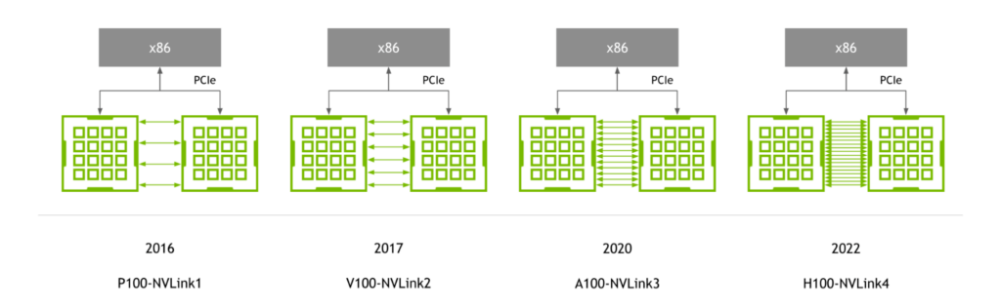
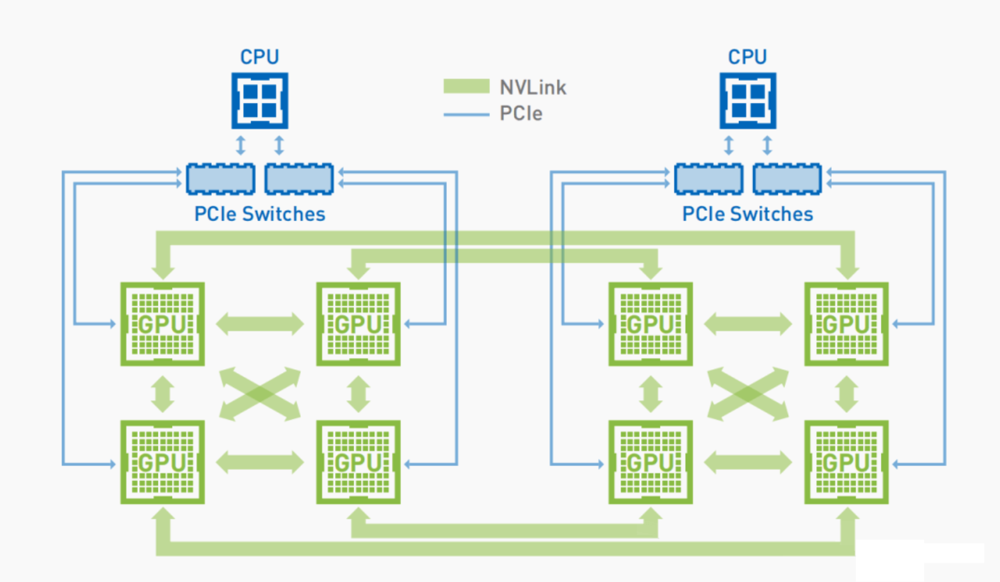
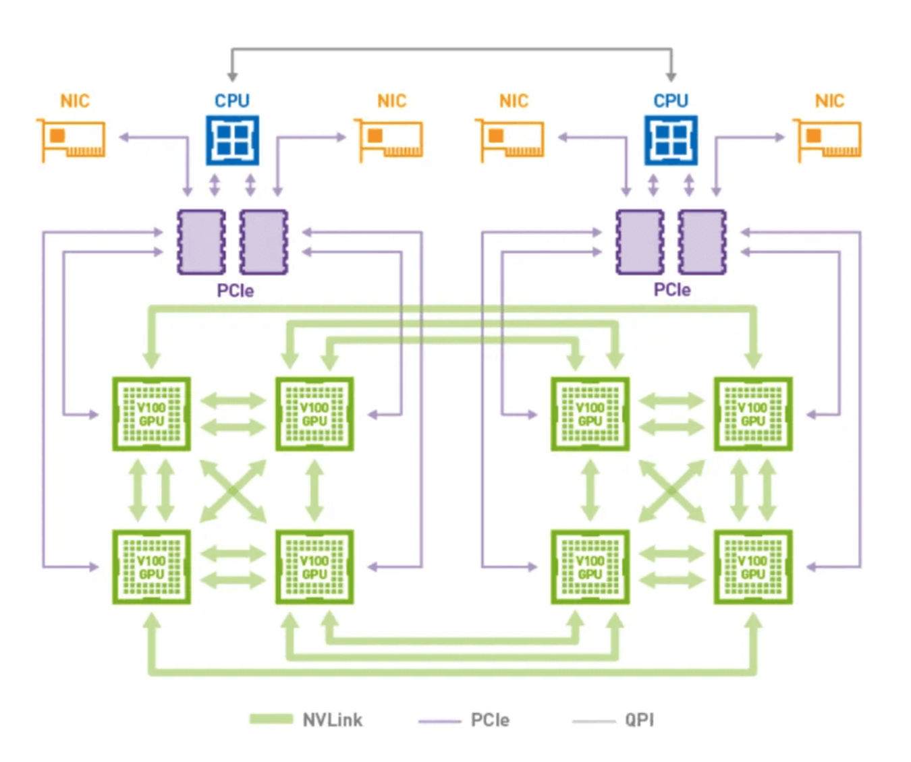
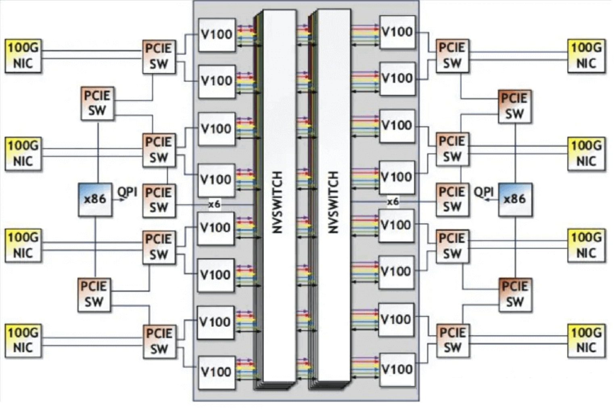
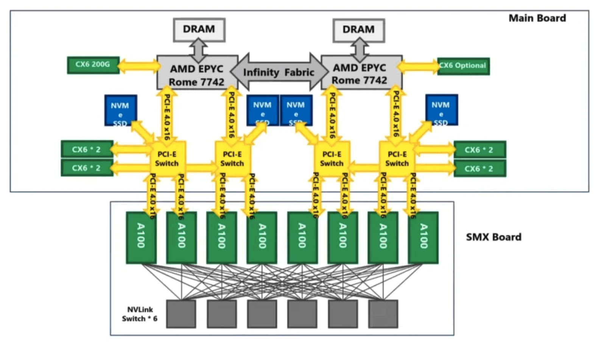
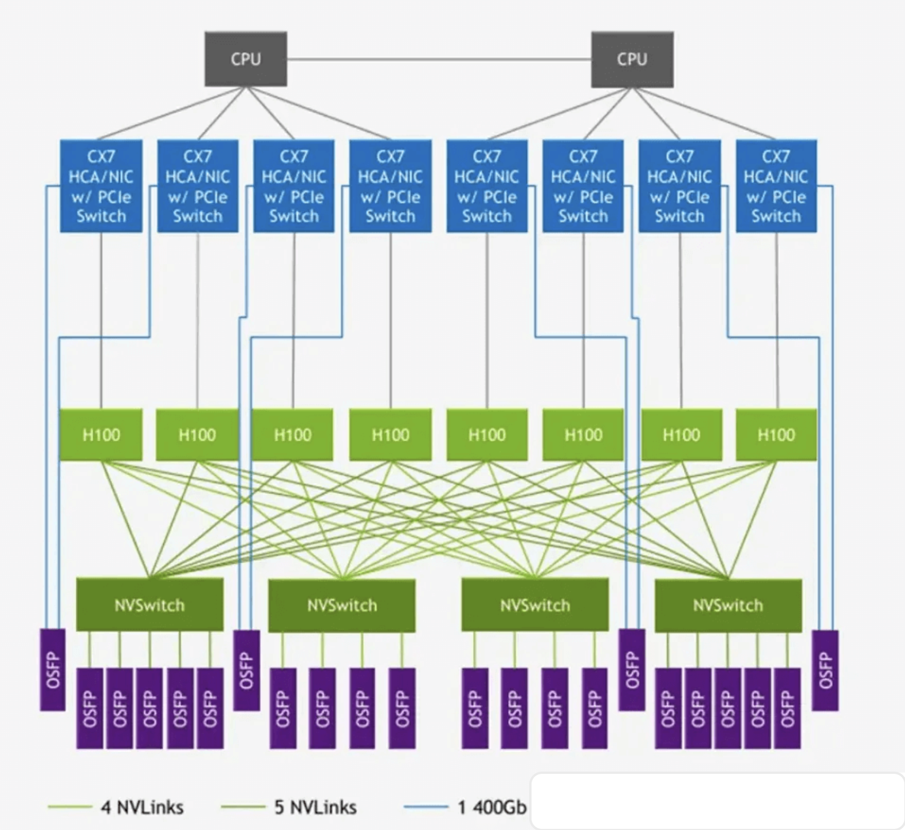
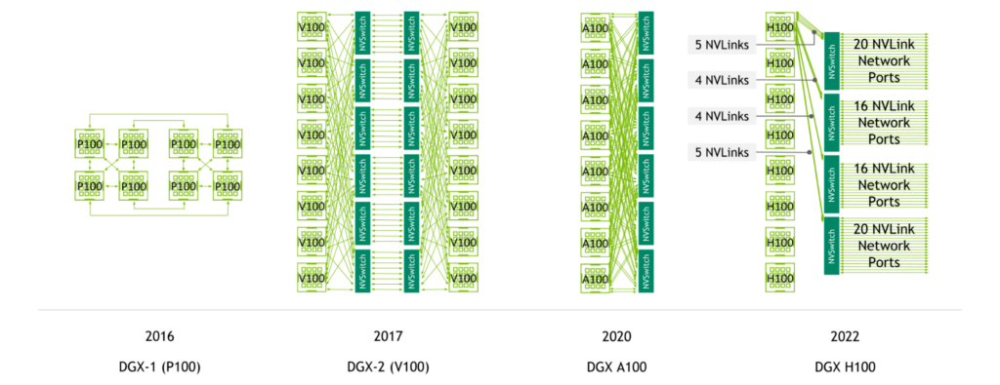
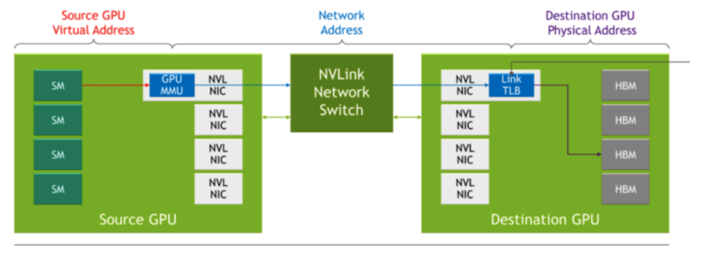
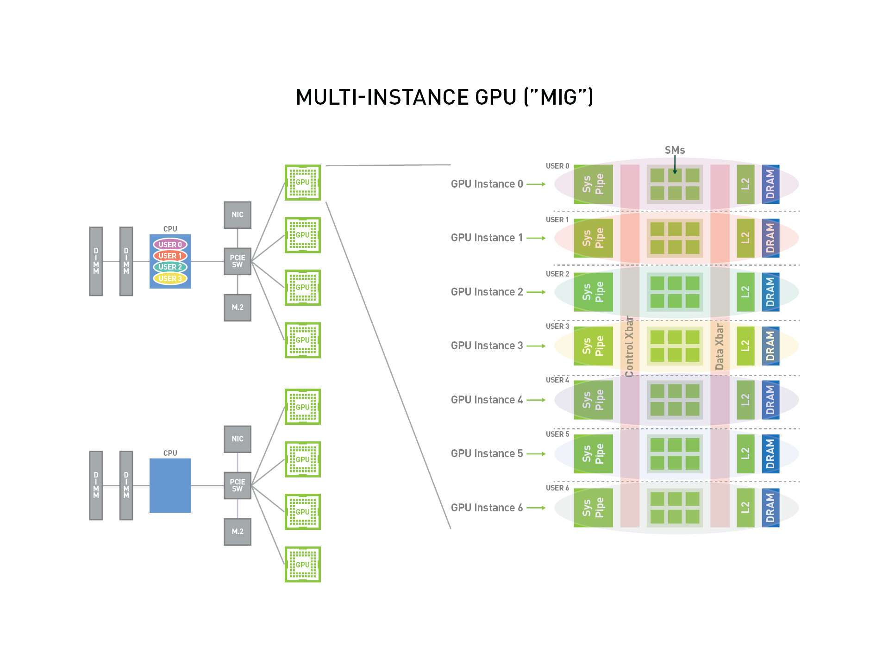

# NVidia GPU 세대

**목차**
1. [AI 시대의 GPU 요구 사항](nvidia_gpu_features.md#1-ai-시대의-gpu-요구-사항) 
2. [세대별 NVLink](nvidia_gpu_features.md#2-세대별-nvlink) 
3. [NVidia GPU 활성화](nvidia_gpu_features.md#3-nvidia-gpu-활성화) 
 
 

## 1. AI 시대의 GPU 요구 사항

AI 시대에서 다양한 워크로도를 위한 GPU의 여러 기능들이 소개되고 발전하고 있습니다. 단일 GPU에서, 다중 GPU, 그리고 여러 노드 상에 GPU 연결까지, 고성능 / 고속 통신 / 확장 가능은 주요 특징으로 기술이 발전하고 있습니다. 

**고성능 AI 워크로드를 위한 요구사항**
* 높은 대역폭 및 확장 가능을 통한 고성능 제공
  + NVLink를 통한 GPU이 필요한 성능과 확장성 제공
  + NVidia GPU의 스레드-블록 실행 구조는 병렬 방식의 NVLink 아키텍처를 효율적으로 유지
  + NVlink-Port 인터페이스는 GPU L2 캐시의 데이터 교환의 최대치 제공
* PCIe보다 빠른 속도의 NVLink
* 기존 네트워크보다 낮은 오버헤드
  + GPU 연결을 고속 점대점 링크로 설계를 통해 기존 네트워크보다 오버헤드를 낮춤
  + 늘어난 포트 수에 맞게 엔드-투-엔드 재시도, 적응형 라우팅, 패킷 순서 변경 등 기존 네트워크에서 볼 수 있는 복합 네트워킹 기능도 대부분 지원
  + 네트워크 인터페이스가 크게 간소화되어 애플리케이션 계층, 프레젠테이션 계층, 세션 계층 기능을 CUDA에 직접 삽입할 수 있기 때문에 통신 오버헤드가 크게 줄임
 
 

## 2. NVLink와 NVSwitch

### 2.1 세대별 NVLink

 

### 2.2 NVIDIA GPU 네트워크 아키텍처

* 2016년: P100-NVLink1
  + Tesla P100 / Pascal 아키텍처
    
  + 대역폭: 20GB x 4 x 2 = 160 GB/s
  + NVSwitch 칩이 없어서 GPU는 메시-토폴로지로 상호 연결

* 2017년: V100-NVLink2
  + V100 / Volta 아키텍처
    
  + 대역폭: 25GB x 6 x 2 = 300 GB/s

* 2018년: V100 DGX-2
  + NVSwitch 기반 최초 시스템
    
  + NVSwitch는 18개의 NVLink 포트
    - 8개는 GPU에 연결
    - 8개는 다른 NVSwitch에 연결

* 2020년: A100-NVLink3
  + A100 / Ampere 아키텍처
    
  + 대역폭: 25GB x 12 x 2 = 600 GB/s
  + NVSwitch 2.0 x 6개
  + DGX-A100 (NVLink 3.0 / NVSwitch 2.0)
    - A100 x 8개
    - 각각의 A100이 6개의 NVSwitch에 2개의 링크식 총 12개의 NVLink로 연결

* 2022년: H100-NVLink4
  + H100 / Hopper 아키텍처
    
  + 대역폭: 25GB x 18 x 2 = 900 GB/s
  + NVSwitch 3.0 x 4 
  + DGX-H100 (NVLink 4.0 / NVSwitch 3.0)
    - H100 x 8개
    - 외장형 NVLink Switch까지 추가하면, 다수의 노드에서 NVLink 속도로 멀티-GPU 통신까지 가능
  + NVSwitch의 OSFP 인터페이스
    - DGX-H100 256 SuperPod 솔루션과 같은 대규모 GPU 네트워크에 사용
    - 32 노드 * 8 GPU = 256 GPU
 

### 2.3 DGX 세대별 아키텍처

 

### 2.4 NVLink와 NVSwitch

다음은 소스 GPU 내 SM이 MMU를 액세스하면, NVLink 네트워크 스위치를 통해 타겟 GPU 내 TLB를 통해 실제 물리 메모리인 HBM에 액세스하는 것을 보여 줍니다.

**NVLink 스위치 시스템을 통한 연결**

* GPU의 SM(Streaming Multiprocessor)
  + NVIDIA GPU에서 연산 단위
  + H100은 144개의 SM으로 구성
  + SM 각각은 고유 메모리, 캐시, 컴퓨팅 코어를 가짐
  + 병렬적으로 처리할 수 있는 작업을 할당 받아 수행
* GPU의 MMU(Memory Manament Unit)
* TLB(Translation Lookaside Buffer)
  + 프로세서 내부의 MMU 안에 존재
  + 가상 메모리 주소를 물리적 주소로 변환하는 속도를 높이기 위해 사용하는 캐시
* HBM (High Bandwidth Memory)
 
 

## 3. NVIDIA GPU 활성화

### 3.1 하드웨어 가속화

#### 3.1.1 하드웨어 종류

* GPUs: Graphical Processing Units
* NPUs: Neural Processing Units
* ASICs: Application-Specific Integrated Circuits
* DPUs: Data Processing Units

#### 3.1.2 지원되는 하드웨어 액셀레이터

* NVIDIA  GPU
* AMD Instinct GPU
* INTEL Gaudi
 

### 3.2 플랫폼 별 NVIDIA 구성

#### 3.2.1 오픈시프트를 위한 GPU 활성화

* 오픈시프트 베어메탈
  + 컨트롤-플레인을 GPU 노드로 구성 가능
  + 워커 노드는 GPU 구성 가능
    - 각각의 노드는 같은 타입의 GPU만 구성 가능
    - 같은 노드에 다른 GPU 모델 구성은 지원하지 않음
  + 컨테이너를 위한 GPU 구성
    - GPU passthrough
    - Multi-Instance GPU (MIG)
  + 가상머신을 위한 GPU 구성
    - GPU passthrough
    - GPU time-slicing (vGPU)

* RHEL KVM
  + 다른 GPU 모델 구성 가능
  + GPU들을 가상머신에 할당 가능
    - 가상머신 상에 오픈시프트 노드 구성 시, 같은 타입의 GPU들만 가상머신에 할당
  + 가상머신을 위한 GPU 구성
    - GPU passthrough
    - GPU time-slicing (vGPU)
 

### 3.3 GPU 공유 방법

#### 3.3.1 GPU 동시 사용 메커니즘

* Compute Unified Device Architecture (CUDA) 스트림
* Time-slicing
* CUDA Multi-Process Service (MPS)
* Multi-instance GPU (MIG)
* vGPU를 통한 가상화

#### 3.3.2 CUDA 스트림

NVIDIA가 GPU에서 일반 컴퓨팅을 위해 개발한 병렬 컴퓨팅 플랫폼 및 프로그래밍 모델
* 스트림은 GPU에서 발행 순서대로 실행되는 일련의 작업
* CUDA 명령은 일반적으로 기본 스트림에서 순차적으로 실행되고 작업은 이전 작업이 완료될 때까지 시작되지 않음
* 여러 스트림에서 비동기적으로 작업을 처리하면 작업을 병렬로 실행 가능
* 한 스트림에서 발행된 작업은 다른 작업이 다른 스트림으로 발행되기 전, 중 또는 후에 실행됨
  + GPU는 지정된 순서 없이 여러 작업을 동시에 실행할 수 있어 성능이 향상

#### 3.3.3 Time-slicing

여러 CUDA 애플리케이션을 실행할 때 오버로드된 GPU에 예약된 워크로드를 인터리빙
* GPU에 대한 복제본 세트를 정의하여 쿠버네티스에서 GPU 타임 슬라이싱을 활성화
  + 각 복제본은 워크로드를 실행할 포드에 독립적으로 분산
  + 다중 인스턴스 GPU(MIG)와 달리 복제본 간에 메모리 또는 오류 격리가 없음
* 내부적으로 GPU 타임 슬라이싱은 동일한 기본 GPU의 복제본에서 워크로드를 멀티플렉싱하는 데 사용
* 타임 슬라이싱 구성 적용
  + 클러스터 전체 기본 구성을 적용 가능
  + 노드별 구성을 적용도 가능
  + 적용 예
    - Tesla T4 GPU가 있는 노드에만 타임 슬라이싱 구성을 적용
    - 다른 GPU 모델이 있는 노드는 적용하지않음
  + 구성 방안
    - 클러스터 전체 기본 구성을 적용
    - 노드에 레이블을 지정하여 해당 노드에 노드별 구성을 제공
    - 이를 통해 위 두 가지 접근 방식을 결합

#### 3.3.4 CUDA Multi-Process Service (MPS)

단일 GPU에서 여러 CUDA 프로세스를 사용
* 프로세스는 GPU에서 병렬로 실행되어 GPU 컴퓨팅 리소스의 포화 상태를 제거
* 커널 작업의 동시 실행 또는 중복과 다른 프로세스에서 메모리 복사를 가능하게 하여 활용도를 높임

#### 3.3.5 Multi-instance GPU (MIG)

GPU 컴퓨팅 유닛과 메모리를 여러 MIG 인스턴스로 분할
* 각 인스턴스는 시스템 관점에서 독립형 GPU 장치를 나타냄
* 노드에서 실행되는 모든 애플리케이션, 컨테이너 또는 가상 머신에 연결 가능
* GPU를 사용하는 소프트웨어는 이러한 각 MIG 인스턴스를 개별 GPU로 처리

MIG는 전체 GPU의 전체 성능이 필요하지 않은 애플리케이션이 있는 경우 유용
* NVIDIA Ampere 아키텍처부터 MIG 기능을 소개
* 하드웨어 리소스를 여러 GPU 인스턴스로 분할할 수 있으며, 각 인스턴스는 운영 체제에서 독립적인 CUDA 지원 GPU로 사용
* NVIDIA GPU Operator 버전 1.7.0 이상은 A100 및 A30 Ampere 카드에 대한 MIG 지원을 제공
  + GPU 인스턴스는 최대 7개의 여러 독립 CUDA 애플리케이션을 지원하도록 설계
  + 각각은 전용 하드웨어 리소스로 완전히 격리되어 작동

#### 3.3.6 vGPU를 통한 가상화

가상 머신은 NVIDIA vGPU를 사용하여 단일 물리적 GPU에 직접 액세스
* 가상머신들에서 공유될 수 있고, 다른 기기에서 액세스가 가능한 가상 GPU 생성 가능
* 이 기능은 GPU 성능의 힘과 vGPU가 제공하는 관리 및 보안 이점을 결합
 

### 3.4 NVIDIA의 MIG(Multi-Instance GPU) 기능

#### 3.4.1 개요

**MIG란**
* CUDA 애플리케이션을 위한 최대 7개의 별도 GPU 인스턴스로 안전하게 분할
* 여러 사용자에게 최적의 GPU 활용을 위한 별도 GPU 리소스로 제공
* 권장 사용 사례
  + GPU의 컴퓨팅 용량을 완전히 포화시키지 않는 워크로드에 특히 유용
  + 사용자는 활용도를 극대화하기 위해 여러 워크로드를 병렬로 실행
* 사용 사례: 다중 테넌트 사용 사례가 있는 클라우드 서비스 공급자(CSP)
  + 한 클라이언트가 다른 클라이언트의 작업이나 일정에 영향을 미치지 않도록 보장
  + 동시에 고객에게 향상된 격리를 제공

**아키텍처**

* 각 인스턴스의 프로세서가 전체 메모리 시스템을 통해 별도이고 격리된 경로를 가짐
* 온칩 크로스바 포트, L2 캐시 뱅크, 메모리 컨트롤러 및 DRAM 주소 버스는 모두 개별 인스턴스에 고유하게 할당
* 특징
  + 개별 사용자의 워크로드는 다른 작업이 자체 캐시를 스래싱하거나 DRAM 인터페이스를 포화시키더라도 동일한 L2 캐시 할당 및 DRAM 대역폭으로 예측 가능한 처리량 및 대기 시간으로 실행
  + 사용 가능한 GPU 컴퓨팅 리소스(스트리밍 멀티프로세서 또는 SM, 복사 엔진 또는 디코더와 같은 GPU 엔진 포함)를 분할하여 VM, 컨테이너 또는 프로세스와 같은 다양한 클라이언트에 대한 오류 격리를 통해 정의된 서비스 품질(QoS)을 제공
  + 여러 GPU 인스턴스가 단일 물리적 NVIDIA Ampere 아키텍처 GPU에서 병렬로 실행

**MIG가 지원하는 배포 구성**
* 컨테이너를 포함한 베어 메탈
* 지원되는 하이퍼바이저 상의 리눅스 게스트에 대한 GPU passthrough 가상화
* 지원되는 하이퍼바이저 상의 vGPU

> [!IMPORTANT]
> MIG는 여러 vGPU(및 가상머신)가 단일 GPU에서 병렬로 실행되도록 허용하면서 vGPU가 제공하는 격리 보장을 유지합니다.
 
 

## 99. 참조

**레드햇**
* 매뉴얼 - [오픈시프트 4.18 - 하드웨어 액셀레이터](https://docs.redhat.com/en/documentation/openshift_container_platform/4.18/html-single/hardware_accelerators/index#nvidia-gpu-time-slicing_nvidia-gpu-architecture)

**NVIDIA**
* 매뉴얼 - [MIG 사용자 가이드](https://docs.nvidia.com/datacenter/tesla/mig-user-guide/)
* 블로그 - [3세대 NVIDIA NVSwitch를 통한 멀티-GPU 인터커넥트 업그레이드](https://developer.nvidia.com/ko-kr/blog/3%EC%84%B8%EB%8C%80-nvidia-nvswitch%EB%A5%BC-%ED%86%B5%ED%95%9C-%EB%A9%80%ED%8B%B0-gpu-%EC%9D%B8%ED%84%B0%EC%BB%A4%EB%84%A5%ED%8A%B8-%EC%97%85%EA%B7%B8%EB%A0%88%EC%9D%B4%EB%93%9C/)

------
[차례](../README.md)