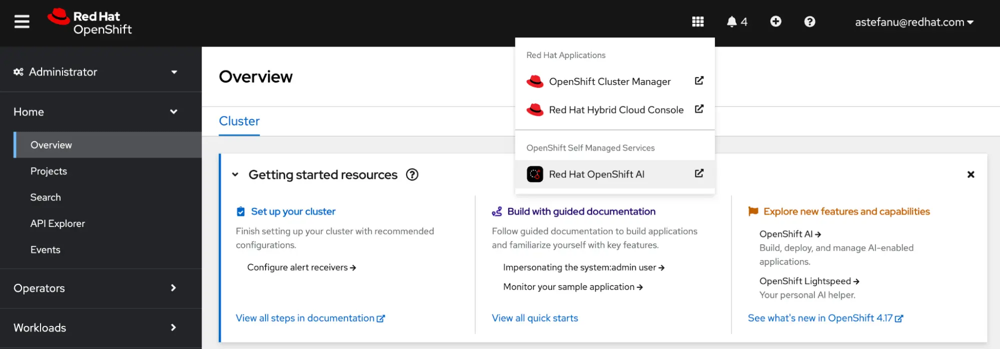
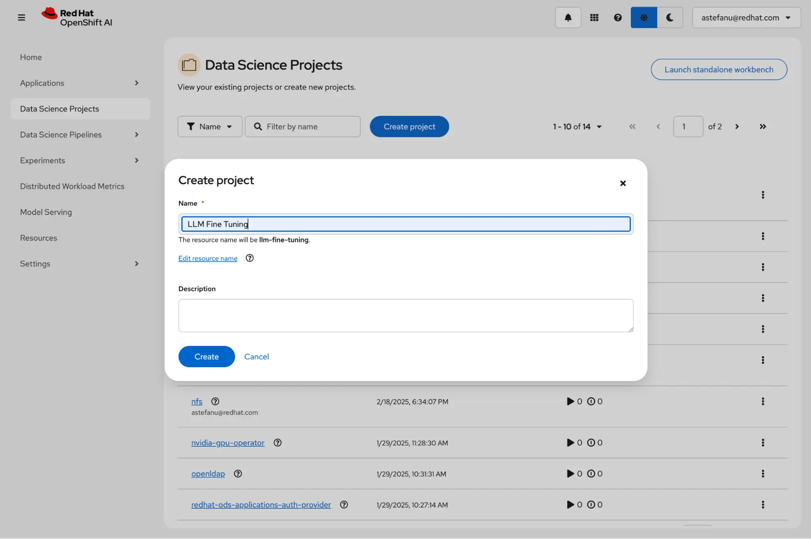
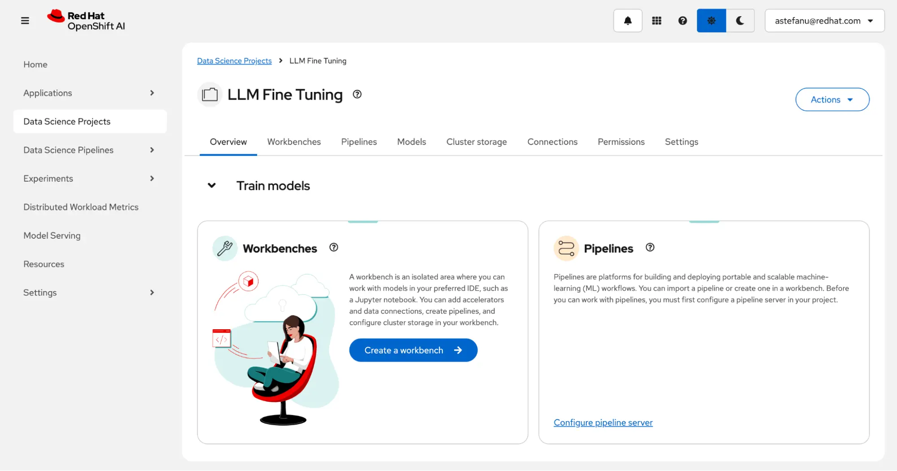
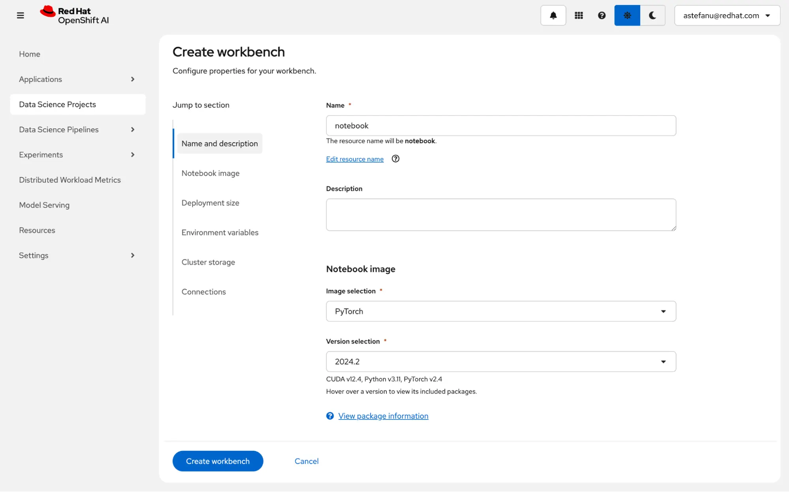
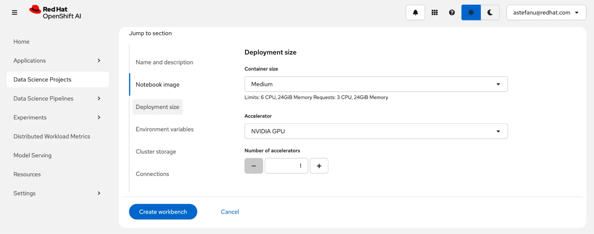
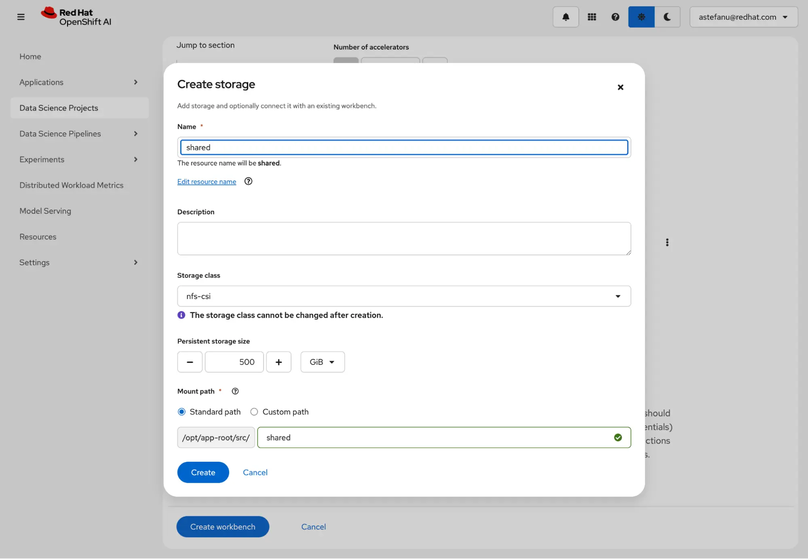
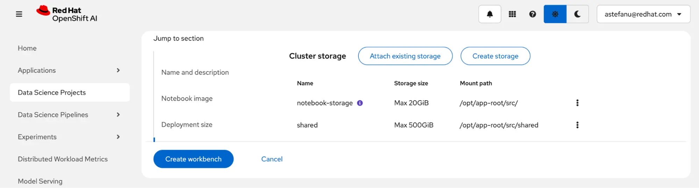
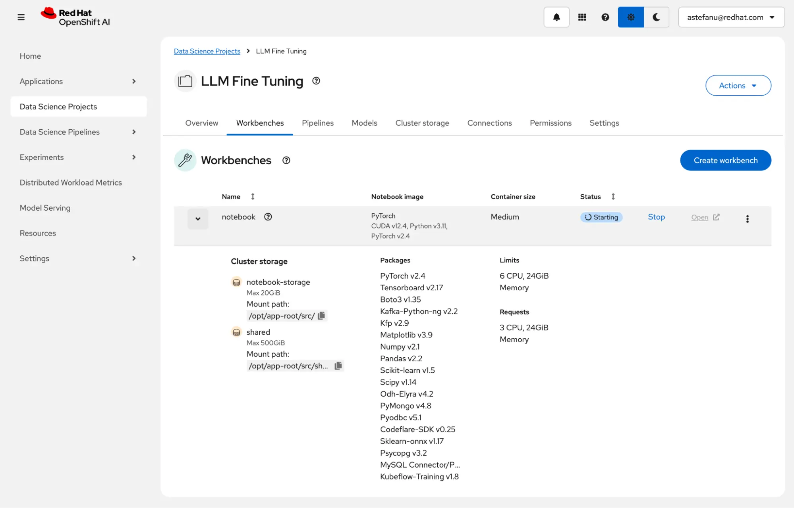
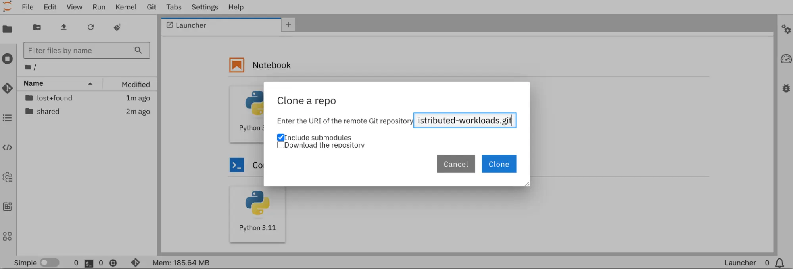
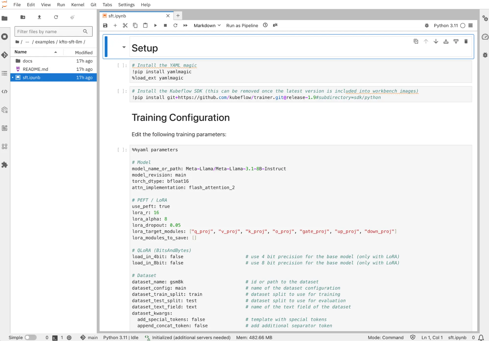

# 오픈시프트 상에서 Kubeflow Trainer를 사용하여 LLM Fine-Tuning

**목차**
1. []()<br>
2. []()<br>
3. []()<br>
4. []()<br>

## 1. 개요

### 1.1 LLM과 레드햇 오픈시프트 AI

대규모 언어 모델(LLM)은 여전히 ​​집중적인 연구 분야이며, 새로운 산업으로 빠르게 확산되고 있습니다. 여러 기업에서 매주 새로운 학술 논문과 업데이트된 오픈 모델이 발표되면서 기존 폐쇄형 소스 모델과의 격차를 줄이고 있습니다. 오픈 소스 커뮤니티 덕분에 인기 프로젝트에 새로운 모델과 혁신이 지속적으로 통합되어 도입 장벽을 낮추고 최첨단 기술을 따라잡는 데 필요한 마찰을 해소하고 있습니다.

하지만 심층 신경망(소프트웨어 2.0이라고도 함) 기반 애플리케이션은 모델을 학습하고 제공하기 위해 강력한 가속기를 필요로 하며, 인프라를 상호 연결하고 사용자에게 소프트웨어와 하드웨어 간의 호환성과 유연성을 보장하는 통합 플랫폼은 경쟁 우위를 확보하는 데 중요한 요소입니다.

레드햇 오픈시프트 AI는 PyTorch, Kubeflow, vLLM과 같은 오픈 소스 프로젝트를 오픈시프트 상에 구축합니다. 

**레드햇 오픈시프트 AI**
* 다양한 가속기를 지원
* Kueue와 같은 워크로드 오케스트레이션 도구를 활용
* 벤더-록인 최소화 / 활용도 극대화 / 투자 수익률(ROI)을 높임
* Kubeflow Training 오퍼레이터 & SDK
  + PyTorch 및 HuggingFace Transformers와 같은 인기 라이브러리를 사용
  + 오프시프트에서 모델을 훈련하는 데 Kubeflow를 사용 가능
  + [fms-hf-tuning](https://github.com/foundation-model-stack/fms-hf-tuning)과 같은 더욱 맞춤화된 라이브러리를 활용 가능

### 1.2 Kubeflow Trainer를 통한 LLM Fine-Tuning

* Kubeflow Training 오퍼레이터 및 SDK 사용
  + SFTTrainer (Hugging Face Supervised Fine-tuning Trainer)
  + LoRA/QLoRA
  + PyTorch FSDP (Fully Sharding Data Parallel)

* 최적화
  + FlashAttention 및 Liger Kernel를 통한 최적화/융합 커널를 통한 메모리 소비 개선
  + 효율적인 GPU P2P 통신
<br>
<br>

## 2. 랩 환경 구성

### 2.1 시스템 구성

#### 2.1.1 플랫폼 구성

* 오픈시프트 4.14+
* 오픈시프트 AI 오퍼레이터 2.19+
  + 대시보드
  + 워크벤치
  + 훈련 오퍼레이터
  + 기타 등등 활성화
* 워커 노드 상에 GPU
  + NVidia GPU (Ampere 이상의 GPU)
  + AMD 가속기 (Instinct MI300X 이상의 가속기)
* Node Feature Discovery 오퍼레이터
* GPU 오퍼레이터
  + NVidia GPU 오퍼레이터 ([ClusterPolicy](https://docs.nvidia.com/datacenter/cloud-native/openshift/latest/install-gpu-ocp.html#create-the-clusterpolicy-instance) 리소스 설정)
  + AMD GPU 오퍼레이터 ([구성 방법](https://instinct.docs.amd.com/projects/gpu-operator/en/latest/installation/openshift-olm.html#configuration))
* 스토리지 클래스 제공
  + 동적 프로비저닝을 제공하는 PVC
  + RWX (ReadWriteMany) 액세스 모드
  + 예
    - 오픈시프트 데이터 파운데이션 (ODF)
    - [NFS 동적 프로비저너](https://github.com/opendatahub-io/distributed-workloads/tree/main/workshops/llm-fine-tuning#nfs-provisioner-optional)

#### 2.2.2 AI 

* 예제 리포지토리: [LLM fine-tuning w/ Kubeflow Training on OpenShift AI](https://github.com/opendatahub-io/distributed-workloads.git)
* 사전 훈련된 AI 모델: [Llama 3.1 8B Instruct](https://huggingface.co/meta-llama/Llama-3.1-8B-Instruct)
* 데이터 셋: 허깅페이스의 [GSM8K](https://huggingface.co/datasets/openai/gsm8k)

<br>

### 2.2 워크벤치 생성

#### 2.2.1 RHOAI 대시보드에 로그인

오픈시프트 웹 콘솔 상단에서 RHOAI 대시보드에 액세스


* 지정한 사용자 로그인 정보를 이용

#### 2.2.2 데이터 사이언스 프로젝트 생성

왼쪽 메뉴에서 **Data Science Projects** 선택 후 **Create project**를 클릭


* 프로젝트 이름 (예: `LLM Fine Tuning`) 입력 후 **Create**를 클릭

#### 2.2.3 워크벤치 생성

생성된 프로젝트 `LLM Fine Tuning`에서 **Create a workbench**를 클릭

<br>

### 2.3 워크벤치 설정

#### 2.3.1 이름 및 노트북 이미지 설정



* *Name and description* 섹션
  + 이름: `notebook`
* *Notebook image* 섹션
  + 이미지: `PyTorch` (NVidia GPU) 또는 `ROCm-PyTorch` (AMD 가속기) 
  + 버전: 기본값 사용

#### 2.3.2 컨테이너 크기 및 가속기 설정



* *Deployment size* 섹션
  + 컨테이너 크기: `Medium`
  + 가속기: NVidia GPU (혹은 AMD)

#### 2.3.3 스토리지 설정



* *Cluster storage* 섹션
  + 스토리지 생성
    - 이름: `shared`
    - 스토리지 클래스: `nfs-csi` (예: 동적 프로비저너로 구성된 NFS 스토리지 클래스)
    - 크기: `500` GiB
    - 마운트 경로: *Standard path* (`/opt/app-root/src/shared`)
* 해당 스토리지는 워크벤치인 `notebook`과 Finin-Tuning 작업사이에서 모델 체크포인트를 유지하기 위한 공유 저장소
  + 이를 위해 RWX가 제공되는 스토리지 클래스에서 생성

#### 2.3.4 설정 리뷰후 워크벤치 생성



* 클러스터 스토리지 설정을 리뷰
* **Create workbench**를 클릭
<br>

### 2.4 프로젝트 `LLM Fine Tuning`의 **워크벤치** 탭에서 `notebook` 상태 확인



* 워크벤치가 준비되면 **Open**을 클릭
<br>
<br>

## 3. LLM Fine-Tuning

### 3.1 LLM Fine-Tuning 노트북 예제 준비

#### 3.1.1 Git에서 예제를 복제



1. 노트북의 왼쪽 메뉴의 Git 아이콘을 클릭
2. 아래 URL을 입력
   ```
   https://github.com/opendatahub-io/distributed-workloads.git
   ```
3. **Clone**을 클릭하여 Git의 리포지토리를 복제

#### 3.1.2 *sft.ipynb* 노트북 오픈



1. 네비게이션 창에서 `distributed-workloads/examples/kfto-sft-llm` 디렉터리로 이동
2. 파일 `sft.ipynb`을 클릭
<br>

### 3.2 Fine-Tuning 작업 구성

#### 3.2.1 `[sft.ipynb](https://github.com/opendatahub-io/distributed-workloads/blob/main/examples/kfto-sft-llm/sft.ipynb)`의 모델 및 데이터셋 구성

```yaml
# Model
model_name_or_path: Meta-Llama/Meta-Llama-3.1-8B-Instruct
model_revision: main
# Dataset
dataset_name: gsm8k                       # id or path to the dataset
dataset_config: main                      # name of the dataset configuration
```

#### 3.2.2 `[sft.ipynb](https://github.com/opendatahub-io/distributed-workloads/blob/main/examples/kfto-sft-llm/sft.ipynb)`의 PEFT 및 LoRA 구성

```yaml
# PEFT / LoRA
lora_r: 16
lora_alpha: 8
lora_dropout: 0.05
lora_target_modules: ["q_proj", "v_proj", "k_proj", "o_proj", "gate_proj", "up_proj", "down_proj"]
```

> [!NOTE]
> PEFT는 Parameter-Efficient Fine-Tuning의 약자입니다.

> [!INFORMATION]
> **LoRA**
> * 전체 미세 조정에 비해 학습되는 매개변수 수를 대폭 줄임
> * 비슷한 성능을 유지
> * 제한된 컴퓨팅 리소스를 수용할 수 있는 유연성을 제공
> <br>
> **LoRA 사용 예**
> 사전 훈련된 모델인 Llama 3.1 8B Instruct의 8,072,204,288개의 매개변수 대신에, 기본 LoRA 매개변수를 사용하면  41,943,000개만으로 훈련 가능한 매개변수가 생성되며, 이는 모델 매개변수 대비 0.5196%에 불과합니다.

> [!INFORMATION]
> **[Catastrophic Forgetting](https://en.wikipedia.org/wiki/Catastrophic_interference)**
> * 추가된 LoRA 어댑터 가중치만 학습되고 사전 학습된 모델의 원래 가중치는 변경되지 않음
> * 모델이 사전 훈련 중에, 훈련한 지식이 다른 데이터셋에서 미세 조정된 후에도 "***잊혀지지***" 않도록 유지
<br>

### 3.3 데이터셋 준비


### 3.4 클라이언트 SDK 구성


### 3.5 Fine-Tuning 작업 생성


<br>
<br>

## 4. 

<br>
<br>

------
[차례](../README.md)