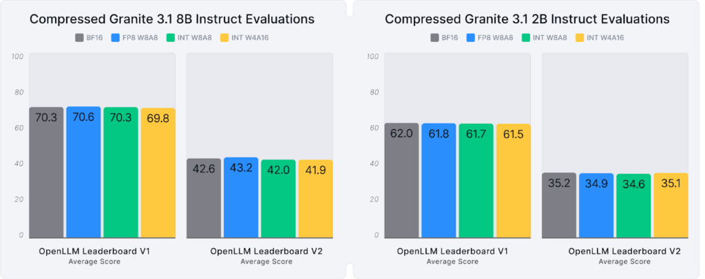
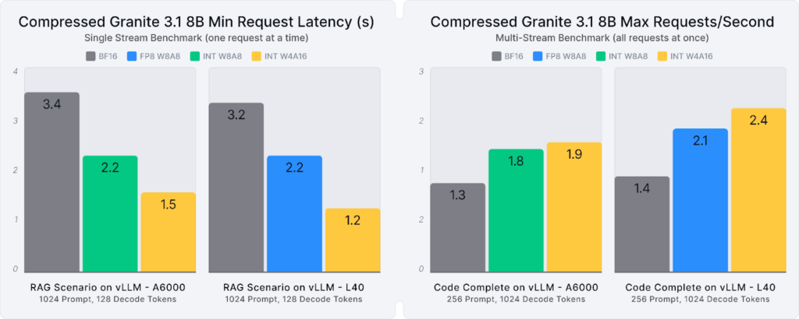
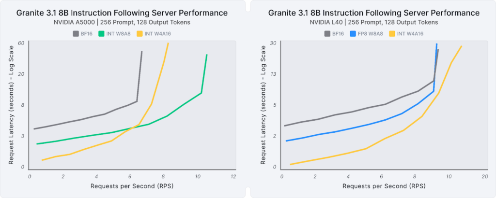
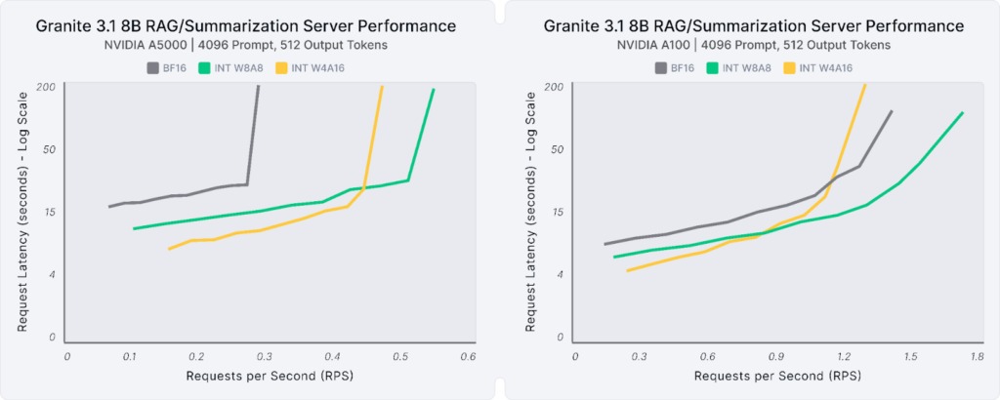

# 양자화 모델

**차례**
1. Neural Magic을 통한 모델 압축<br>
2. GGUF vs GGML<br>
&nbsp;&nbsp;2.1 [PT-Generated Unified Format(GGUF)란](gguf_vs_gglm.md#1-pt-generated-unified-formatgguf란)<br>
&nbsp;&nbsp;2.2 [GGUF와 GGML의 차이](gguf_vs_gglm.md#2-gguf와-ggml의-차이)<br>
&nbsp;&nbsp;2.3 [GGUF로 전환](gguf_vs_gglm.md#3-gguf로-전환)<br>
3. []()<br>

<br>

## 1. Neural Magic을 통한 모델 압축

### 1.1 Neural Magic

* 개방적이고 효율적인 AI를 제공한다는 사명을 가속화
* 새로운 압축 Granite 3.1 모델은 엔터프라이즈 배포용으로 설계
  + 기존 모델보다 3.3배 더 작은 크기
  + 최대 2.8배 향상된 성능
  + 99%의 정확도 복구를 달성
* 모델과 레시피는 Hugging Face에서 오픈 소스로 제공
* vLLM을 통해 배포 가능하고 LLM Compressor를 사용하여 확장 가능
<br>

### 1.2 압축된 모델 평가

#### 1.2.1 압축된 Granite 3.1 8B 및 2B 모델 출시

* Neural Magic의 첫 번째 기여
* 접근성과 효율성을 향상시키기 위해 Granite 3.1 모델의 양자화 버전을 개발
  + 이러한 압축 변형은 99%의 정확도 복구를 유지
  + 리소스 요구 사항을 줄여 비용 효율적이고 확장 가능한 AI 배포에 이상적
* 사용 가능한 옵션
  |$\color{lime}{\texttt{옵션}}$|$\color{lime}{\texttt{옵션 이름}}$|$\color{lime}{\texttt{설명}}$|
  |:--------|:----------------------------|:---|
  |FP8 W8A8 |FP8 weights and activiations |NVIDIA Ada Lovelace 및 Hopper GPU에서 서버 및 처리량 기반 시나리오에 최적화|
  |INT W8A8 |INT8 weights and activiations|NVIDIA Ampere 및 이전 GPU를 사용하는 서버에 이상적|
  |FP8 W4A16|INT4 weight-only models      |지연 시간에 민감한 애플리케이션이나 GPU 리소스가 제한된 경우에 적합|

#### 1.2.2 성능 평가

**광범위한 평가를 통한 결과**
* 최대 3.3배 더 작음
* 평균 99%의 정확도 복구
* 최대 2.8배 더 뛰어난 추론 성능



> [!NOTE]
> OpenLLM Leaderboard V1과 OpenLLM Leaderboard V2의 평균에 따른 정확도 평가를 위해 Granite 3.1 모델(8B, 2B)의 기준선과 양자화 버전을 비교했습니다.



> [!NOTE]
> 1xA6000 및 1xL40 GPU에서 RAG 및 코드 완성 시나리오에 대한 추론 벤치마크를 위한 Granite 3.1 8B의 기준 버전과 양자화 버전을 비교하여 최상의 지연 시간(단일 스트림) 및 처리량(멀티 스트림) 성능을 비교했습니다.

<br>

### 1.3 압축된 Granite 작동 방식

**작동 방식**
* 압축된 Granite 3.1 모델은 vLLM 생태계와 완벽하게 통합
* 개발자는 이러한 모델을 신속하게 배포 가능
* LLM Compressor를 통해 특정 요구 사항에 맞게 압축 레시피를 추가로 맞춤 설정 가능

**예 - vLLM을 시작**
```py
from vllm import LLM

llm = LLM(model="neuralmagic/granite-3.1-8b-instruct-quantized.w4a16")
prompts = ["The Future of AI is"]

for output in llm.generate(prompts)
    print(f"Prompt {output.prompt}, Generated: {output.outputs[0].text}")
```

### 1.4 에이전트 파이프라인 명령어 수행 평가

#### 1.4.1 작은 요청

**수행 평가**
* 에이전트 파이프라인의 명령어 수행 작업(프롬프트 토큰 256개, 출력 토큰 128개)과 같이 더 작은 요청 크기의 경우, 압축된 Granite 모델은 다양한 GPU에서 지연 시간, 서버 및 처리량 사용 사례 전반에 걸쳐 일관된 성능 향상을 제공



* Single Stream, Latency
  + W4A16은 A5000 대비 2.7배, L40 대비 1.5배 낮은 지연 시간으로 가장 높은 효율성을 달성
* Multi-Stream
  + W8A8 모델은 A5000에서 6 RPS 이후 가장 우수한 성능을 발휘하여 동일한 성능에서 초당 1.6배 더 많은 요청을 처리
  + W4A16은 L40에서 최대 8배 더 많은 요청을 처리
  
> [!NOTE]
> 1xA5000 및 1xL40 GPU에서 명령 추종 서버 기반 추론 성능을 위한 Granite 3.1 8B의 기준 버전과 양자화 버전을 비교하여 요청 속도(RPS)와 요청 지연 시간을 비교합니다.

#### 1.4.2 대용량 요청

**수행 평가**
* 압축 모델은 검색 증강 생성(RAG)이나 요약 워크플로(프롬프트 토큰 4,096개, 출력 토큰 512개)와 같은 대용량 요청에 대해, 비슷한 성능 이점을 제공



* Single Stream, Latency
  + W4A16은 A5000 대비 2.4배, A100 대비 1.7배 낮은 지연 시간으로 최고의 효율성을 달성
* Multi-Stream
  + W8A8 모델은 최고의 성능을 제공하여 동일한 성능에서 A5000 대비 최대 4배, A100 대비 최대 3배 더 많은 요청을 처리

> [!NOTE]
> 1xA5000 및 1xA100 GPU에서 RAG/Summarization 서버 기반 추론 성능을 위한 Granite 3.1 8B의 기준선 및 양자화 버전을 비교하여 요청 속도(RPS)와 요청 지연 시간을 비교합니다.
<br>
<br>

## 2. GGUF vs GGML

### 2.1 PT-Generated Unified Format(GGUF)란

GPT-Generated Unified Format(GGUF)은 대규모 언어 모델(LLM)의 사용 및 배포를 간소화하는 파일 형식입니다. GGUF는 추론 모델을 저장하고 소비자 등급 컴퓨터 하드웨어에서 우수한 성능을 발휘하도록 특별히 설계되었습니다.

**GGUF 특징**
* 효율적인 실행을 위해 모델 매개변수(가중치 및 편향)를 추가 메타데이터와 결합하여 이를 달성
* GGUF는 명확하고 확장 가능하며 다재다능하며 이전 모델과의 호환성을 깨지 않고도 새로운 정보를 통합
* GGUF는 이전 파일 형식인 GGML에서 구축한 기반을 바탕으로 한 최근 개발된 형식
  + 모델의 빠른 로딩 및 저장을 위해 명확하게 설계된 바이너리 형식
  + Python 및 R과 같은 다양한 프로그래밍 언어와 호환 (-> 이 때문에 GGUF는 형식의 인기를 더함)
  + 미세 조정을 지원하므로 사용자는 LLM을 특수 애플리케이션에 맞게 조정
  + 애플리케이션 간 모델 배포를 위한 프롬프트 템플릿을 저장
* GGML은 여전히 ​​사용되고 있지만 지원은 GGUF로 대체됨
<br>

### 2.2 GGUF와 GGML의 차이


<br>

### 2.3 GGUF로 전환

<br>
<br>

## 3. 


<br>
<br>

<hr>

[차례](../README.md)