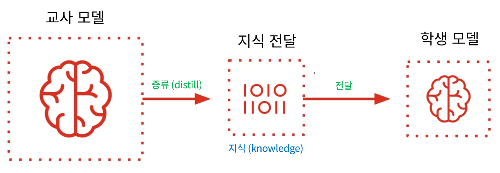
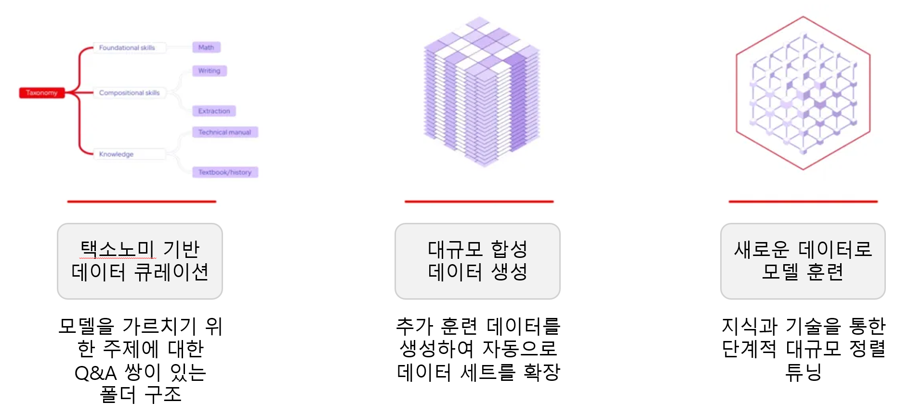

# 합성 데이터 생성 (Synthetic Data Generation)


## 1. 

대규모 언어 모델(LLM)의 품질은 학습 중에 사용되는 데이터의 품질에 크게 좌우된다는 것이 점점 더 분명해지고 있습니다. 반면에 비즈니스 사용 사례에 대한 특수 모델이 필요한 기업의 경우 실제 데이터를 얻고 모델 학습을 위해 주석을 달기가 어려울 수 있습니다. 

이것이 오늘날의 인공 지능(AI) 혁신이 합성 데이터에 의해 구동되는 이유입니다. 합성 데이터는 기존 방법보다 빠르고 저렴하며 확장성이 뛰어난 언어 모델을 학습하고 개선하는 혁신적인 접근 방식입니다.

### 1.1 데이터 딜레마: 합성 데이터가 중요한 이유

#### 1.1.1 고성능 LLM 훈련

* 다양하고 고품질의 방대한 양의 데이터가 필요
* 과거 방식
  + 인터넷의 모든 부분을 스크래핑
  + 데이터 세트를 수동으로 큐레이팅
  + 주석가 팀에 비용을 지불
* 이는 비용이 많이 들고 느리며 때로는 윤리적으로 복잡한 프로세스
  + 예) 의료와 같은 산업의 전문 모델의 경우
    - 기존 데이터에는 개인 식별 정보(PII) 포함
    - HIPPA 또는 EU AI 법과 같은 규정이 적용

#### 1.1.2 맞춤형 AI 모델을 개발하는 조직의 경우

* 데이터 준비 프로세스가 매우 집중적
* 이 때문에 합성 데이터가 필요

#### 1.1.3 합성 데이터

**데이터 중요성**
* 조직은 효과적인 모델을 구축하기에 충분한 데이터를 식별하는 데 어려움을 겪을 수 있음
* 합성 데이터 생성은 모델 개발을 가속화하고 데이터 부족을 극복하는 데 필요해짐
* 많은 SDG 파이프라인은 데이터 처리 및 준비에 대해 동일한 요구 사항을 가짐

**특징**
* 실제 데이터를 증강하는 데 사용되는 인공적으로 생성된 데이터
* 대규모 데이터 세트를 수집하고 레이블을 지정하는 데 드는 시간, 비용 및 법적 장애물을 줄임
* LLM을 활용
  + 인간이 큐레이팅한 대안보다 더 다양하고 포괄적일 수 있는 특수 쿼리를 생성
<br>

### 1.2 합성 데이터 생성 작동 방식

**합성 데이터 설계**
* ***`가짜(fake)`*** 데이터가 아님
* 실제 데이터가 부족할 수 있는 곳에서, 실제 데이터를 ***`모방`***

**합성 데이터 생성 방법**
* 언어 모델에서 일반적으로 사용되는 방법
* 주요 방법
  + 지식 전달
  + 반복적인 자기개선
<br>

#### 1.2.1 지식 전달: 합성 데이터를 위한 모델 증류

**증류**
* 합성 데이터를 생성하는 가장 효과적인 방법 중 하나
* 더 크고 더 진보된 "교사(*teacher*)" 모델(예: Llama 405B)이 더 작은 "학생(*student*)" 모델에 대한 훈련 예제를 만듦
* 이를 통해 지식을 더 전문화된 [소규모 언어 모델(SLM)](https://www.redhat.com/en/topics/ai/llm-vs-slm)로 이전하는 것이 용이
  + 응답 시간이 더 빠르고 배포 후 리소스 집약도가 낮음
  + 특히 Meta의 Llama 라이선스는 3.1 릴리스에서 증류를 명시적으로 허용하도록 변경
  + 많은 독점 모델이 이러한 워크플로를 허용하지 않는다는 점에 **`유의`**하는 것이 중요



* 기존 모델 증류를 사용
* 교사 모델은 더 작은 학생 모델로 지식을 전달하면서 증류

#### 1.2.2 반복적인 자기개선

**반복적인 자기개선**
* 모델은 반복적인 자체 개선을 통해 자체 출력을 개선
  + 일반 텍스트와 사람이 작성한 프롬프트로 시작
  + 모든 종류의 에지 케이스를 포괄하는 복잡한 쿼리로 반복적으로 진화
* 사후 훈련 및 미세 조정
  + 특정 작업이나 지식 분야와 관련된 전문 지식을 개발 시
  + 추가 도메인별 데이터로 보완할 수 있는 지식의 "기반"을 가지고 진행

**자동화된 파이프라인**
* 마이크로소프트의 Evol-Instruct가 그 예 
* 레드햇에서는 IBM Research와 협력하여 InstructLab을 개발
  + LLM 훈련의 지침 조정 단계에서 확장성 문제를 극복
  + 데이터 분류를 구조화하고 주제 전문가가 심층적인 데이터 과학 전문 지식 없이도 기여할 수 있도록 함
  + InstructLab은 지식과 기술로 LLM 역량을 강화하기 위한 비용 효율적이고 확장성이 더 뛰어난 솔루션을 제공

**InstructLab의 모델 훈련**
* 부분적으로 기존 데이터 소스를 합성 데이터 생성을 위한 시드 예제로 변환
  + 더 다양한 출력을 가능하게 함
  + 생성된 데이터에 대한 엄격한 필터링을 구현
  + 다단계 튜닝을 제공
* 이를 통해 모델의 성능을 점진적으로 개선
* 단계적 접근 방식의 재생 버퍼 제공
  + 훈련 안정성을 유지
  + [치명적인 망각](https://en.wikipedia.org/wiki/Catastrophic_interference)을 방지

**InstructLab의 분류법(taxonomy)**


* 모델 사용자 정의를 위한 합성 데이터 생성에 사용할 초기 시드 데이터를 구성

#### 1.2.3 모델 훈련에서 데이터 정제 및 합성 증강

**합성 데이터를 벤치마크와 평가를 개선**
* 기초(foundation) 모델의 다음 진화를 위해 사용
* 한 가지 예는 마이크로소프트의 Phi-4 오픈 소스 모델
  + 다중 에이전트 프롬프트 및 자체 수정 워크플로를 사용
  + 훈련 프로세스에 상당한 양의 합성 데이터를 통합하여 복잡한 추론에 뛰어남
  + 사전 훈련 중에 데이터 정제, 필터링 및 분류를 결합하여 더 높은 품질의 데이터 코퍼스를 생성

**[HuggingFace Cosmopedia 데이터 세트](https://github.com/huggingface/cosmopedia)**
* 250억 개가 넘는 토큰
* 지금까지 가장 큰 규모의 오픈 합성 데이터 세트 중 하나

**[RefinedWeb 데이터 세트](https://arxiv.org/abs/2306.01116)**
* 초기 웹 샘플에는 빵 굽는 방법에 대한 간단한 설명과 함께 "베이킹 기술"에 대한 기사가 포함

**[Mixtral-8x7B-Instruct 모델](https://mistral.ai/en/news/mixtral-of-experts)을 사용하여 데이터의 합성적 재표현**
* 사용자 지정 프롬프트가 모델에 초보자를 위한 자세한 가이드를 만들도록 다음과 같은 지시 가능
  + 예) "완벽한 빵 껍질을 만드는 팁을 포함하여 사워도우 빵 굽는 방법에 대한 단계별 튜토리얼을 작성하세요"
* 이렇게 생성된 합성 데이터는 원래 아이디어를 더욱 심층적이고 명확하게 확장하여 원래 데이터 샘플의 다양성과 품질을 높임

**모델 학습에서의 데이터 정제 및 합성 증강**


* Cosmopedia에서는 초기 웹 추출물과 시드 예시가 다시 표현되어 더 많은 맥락과 더 깊은 배경 맥락을 제공
<br>

### 1.3 합성 데이터의 품질 및 편향 위험

#### 1.3.1 합성 데이터 특징

* 합성 데이터는 엄청난 잠재력을 가짐
* 계산 속도에 의해서만 병목 현상이 발생

#### 1.3.2 합성 데이터 위험성

**모델 붕괴**
* 합성 데이터에 대한 반복적인 학습으로 인해 모델 성능이 저하
* "환각(*hallucinations*)" 또는 지나치게 단순화된 출력의 발생 가능성

**학습 데이터 또는 샘플의 초기 결함이나 편향**
* 이는 생성 프로세스 중에 지속되거나 악화 가능
* 시드 예제에 대한 신중한 인적 큐레이션과 생성 후 검토가 필요

**대체 방안**
* AI 구성 요소인 비평 시스템이 있는 체계적인 파이프라인
  + 다른 AI 모델 또는 시스템의 성능을 평가
  + 고품질 예제만 필터링하는 데 도움
* LLM 주석과 인적 주석을 결합하면 최상의 결과를 제공
<br>

### 1.4 미래의 데이터는 합성 및 개방

**합성 데이터의 역할**
* AI 모델이 계속해서 더욱 정교해짐에 예외가 아닌 기본이 됨
* 합성 데이터의 성공은 투명성과 엄격한 검증에 기반

**합성 데이터를 위한 InstructLab**
* 합성 데이터의 과제를 해결하는 미래를 구축
  + 근거 있는 소스 데이터
  + 주제 전문가의 다양한 기여
  + 자동화된 품질 검사
* 조직과 기업은 특정 사용 사례에 맞게 사용자 정의
* 벤더-락인 없이 고유한 AI 모델을 개발
<br>
<br>

## 2. 

<br>
<br>

## 99. 

실행 명령어
```bash

```

실행 결과
```

```


<br>
<br>

------
[차례](../README.md)