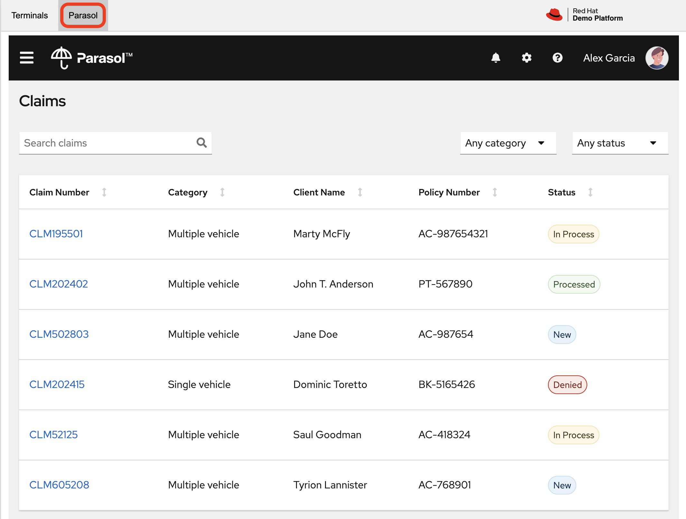
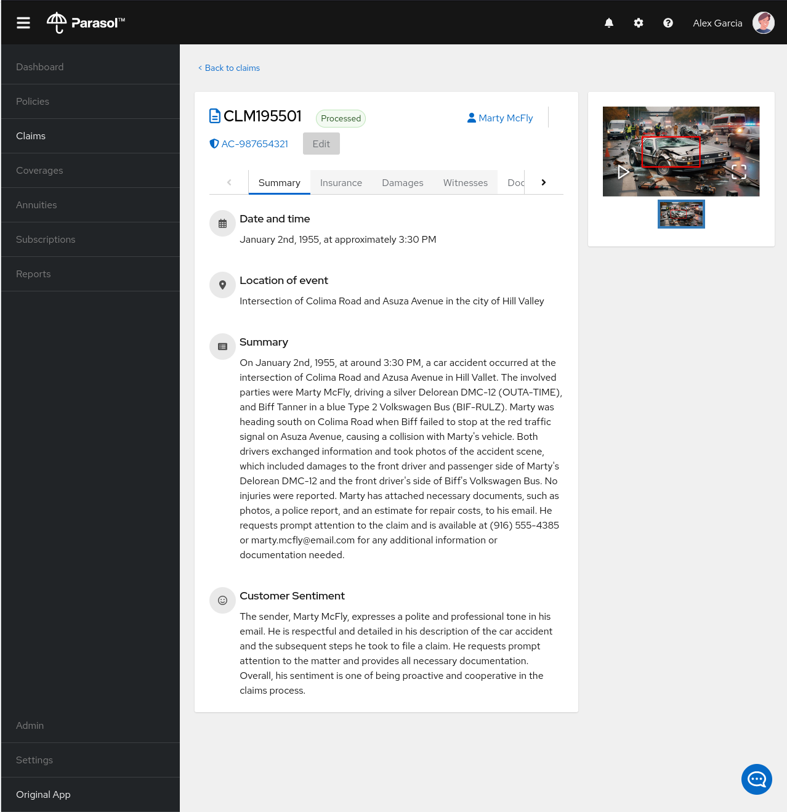
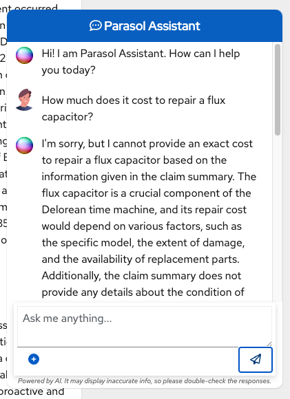
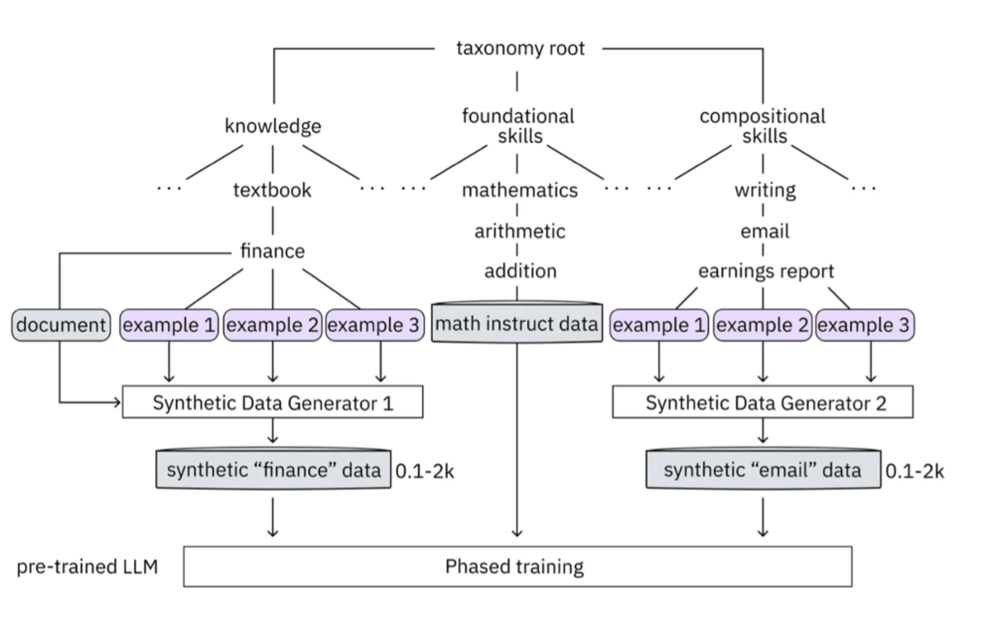

# AI를 보험 앱에 통합하기

목차
* [파라솔 앱 사용](./integrate-ai-into-app.md#파라솔-앱-사용)<br>
* [텍소노미(Taxonomy) 이해하기](./integrate-ai-into-app.md#텍소노미taxonomy-이해하기)<br>
* [합성 데이터 생성](./integrate-ai-into-app.md#합성-데이터-생성)<br>
* [모델 학습 및 상호 작용](./integrate-ai-into-app.md#모델-학습-및-상호-작용)<br>
* [앱 검증](./integrate-ai-into-app.md#앱-검증)<br>
* [랩 요약](./integrate-ai-into-app.md#랩-요약)<br>

<br>
<hr>
<br>

이전 섹션에서는 InstructLab과 상호 작용하는 방법의 기본 사항을 보여주었습니다. 이제 예제 애플리케이션과 함께 InstructLab을 사용하여 한 단계 더 나아가 보겠습니다.
* RHEL AI를 사용하여 granite LLM을 활용
* 지식(knowledge) 및/또는 기술(skills) 형태로 추가 데이터를 더함
* 새로운 지식으로 모델을 학습
* 질문에 효과적으로 답할 수 있게 함
이는 보험 청구를 처리하는 가상 회사인 파라솔(parasol)의 맥락에서 수행됩니다.
<br>

**파라솔(parasol) 보험 시나리오**
파라솔에는 제출된 청구에 대한 수리 제안을 제공하는 AI(granite 모델)가 주입된 챗봇 애플리케이션이 있습니다.
* 목표
  - 이를 통해 파라솔은 보류 중인 다양한 청구를 신속하게 처리 가능
* 문제점 (Pain-Points / Challenges)
  - 하지만 현재 챗봇은 효과적인 수리 제안을 제공하지 않음
* 개선 방안
  - 여러가지 조건에서 수행된 다양한 수리를 포함하는 과거 청구 데이터를 사용하여 사용자가 이 지식을 granite 모델에 추가
  - 추가된 지식으로 모델을 학습
  - 권장 사항을 개선
<br>
<br>

## 파라솔 앱 사용

먼저 클레임 담당자가 챗봇과 상호작용할 때의 현재 경험을 살펴보겠습니다.

### 1. *Parasol*로 전환하여 브라우저에서 파라솔 회사의 클레임 신청서를 확인

</img><br>
* 청구 담당자는 화면에서 청구 번호를 클릭하여 기존 청구를 탐색하고 볼 수 있음
<br>

### 2. *Marty McFly*가 제기한 청구인 **CLM195501**을 조사

해당 청구를 클릭
</img><br>

* 이 페이지에서 청구 내용을 자세히 읽을 수 있음
* DeLorean 이미지를 확대하면 *Marty*가 자신의 차를 얼마나 심하게 파손했는지 확인할 수 있음
  - 바닥의 플럭스 커패시터에 주목
<br>

### 3. 챗봇 확인

청구를 읽은 후 페이지 오른쪽 하단에 있는 작은 파란색 아이콘을 사용하여 챗봇을 클릭

</img><br>

> [!NOTE]
> 챗봇은 이전에 제공한 Granite 모델에 의해 지원되므로 실행 중인 프로세스를 종료한 경우 다음을 실행하여 터미널에서 다시 시작해야 합니다.
<br>

### 4. 챗봇에 질문하기

청구 담당자로서 *Marty*의 DeLorean에서 플럭스 커패시터를 수리하는 데 드는 비용이 얼마인지 알고 싶다고 가정해 보겠습니다. 챗봇에 다음과 같이 입렵합니다.
```
How much does it cost to repair a flux capacitor?
```
</img><br>

> [!NOTE]
> 랩에서 한 것은, Prompt Engineering을 사용하여 LLM과의 각 대화에서 청구에 대한 맥락적 정보를 제공하는 것입니다. 하지만 안타깝게도 챗봇은 플럭스 커패시터를 수리하는 데 드는 비용이나 우리 조직의 도메인별 지식을 알지 못합니다.<br>
> <br>
> InstructLab과 RHEL AI를 사용하면 모델을 학습시켜 이를 바꿀 수 있습니다!
<br>
<br>

## 텍소노미(Taxonomy) 이해하기

InstructLab은 LLM에 대한 새로운 합성 데이터 기반 정렬 튜닝 방법을 사용합니다. InstructLab의 "**LAB**"은 대규모 채팅 봇 정렬(**L**arge-scale **A**lignment for Chat**B**ots)을 의미합니다. LAB 방법은 주로 수동으로 신중하게 생성되는 택소노미(taxonomy)에 의해 구동됩니다.

InstructLab은 새로운 *InstructLab* 오픈 소스 커뮤니티에서 지식(knowledge)과 기술(skills)이라는 두 가지 유형의 데이터를 수집하여 모델을 튜닝하고 개선하는 프로세스를 크라우드소싱합니다. 이러한 제출물은 합성 데이터 생성 프로세스에 사용되는 YAML 파일의 택소노미(taxonomy)에 수집됩니다.

택소노미(taxonomy)의 디렉토리 구조를 이해하는 데 도움이 되도록 다음 이미지를 참조하세요.

</img><br>

이제 분류 모델(taxonomy model)을 활용하여 조직의 공개(및 비공개) 내부 데이터 컬렉션에서 다루는 특정 차량과 그 세부 정보에 대한 모델 지식을 가르칠 것입니다.

### 1. 택소노미(taxonomy) 디렉터리 확인

```bash
cd ~/instructlab/
tree -F -L 1 taxonomy/
```

실행 결과
```
[instruct@bastion ~]$ cd ~/instructlab/

[instruct@bastion instructlab]$ tree -F -L 1 taxonomy/
taxonomy/
├── CODE_OF_CONDUCT.md
├── compositional_skills/
├── CONTRIBUTING.md
├── CONTRIBUTOR_ROLES.md
├── docs/
├── foundational_skills/
├── governance.md
├── knowledge/
├── LICENSE
├── MAINTAINERS.md
├── Makefile
├── README.md
├── scripts/
└── SECURITY.md

5 directories, 9 files
[instruct@bastion instructlab]$ tree -F -L 2 taxonomy/
taxonomy/
├── CODE_OF_CONDUCT.md
├── compositional_skills/
│   ├── arts/
│   ├── engineering/
│   ├── geography/
│   ├── grounded/
│   ├── history/
│   ├── linguistics/
│   ├── miscellaneous_unknown/
│   ├── philosophy/
│   ├── religion/
│   ├── science/
│   └── technology/
├── CONTRIBUTING.md
├── CONTRIBUTOR_ROLES.md
├── docs/
│   ├── assets/
│   ├── contributing_via_GH_UI.md
│   ├── knowledge-contribution-guide.md
│   ├── KNOWLEDGE_GUIDE.md
│   ├── README.md
│   ├── SKILLS_GUIDE.md
│   ├── taxonomy_diagram.md
│   ├── taxonomy_diagram.png
│   ├── template_qna.yaml
│   └── triaging/
├── foundational_skills/
│   └── reasoning/
├── governance.md
├── knowledge/
│   ├── arts/
│   ├── engineering/
│   ├── geography/
│   ├── history/
│   ├── linguistics/
│   ├── mathematics/
│   ├── miscellaneous_unknown/
│   ├── philosophy/
│   ├── religion/
│   ├── science/
│   └── technology/
├── LICENSE
├── MAINTAINERS.md
├── Makefile
├── README.md
├── scripts/
│   ├── check-yaml.py*
│   └── requirements.txt
└── SECURITY.md

30 directories, 19 files
[instruct@bastion instructlab]$ 
```
<br>

### 2. 디렉터리 생성

Instructlab에서 지식을 올바르게 생성하는 방법을 보여주기 위해, 새로운 지식을 추가할 디렉토리를 만듭니다.
```bash
mkdir -pv ~/instructlab/taxonomy/knowledge/parasol/claims
tree -F ~/instructlab/taxonomy/knowledge/parasol/
```

실행 결과
```
(venv) [instruct@bastion instructlab]$ mkdir -pv ~/instructlab/taxonomy/knowledge/parasol/claims
mkdir: created directory '/home/instruct/instructlab/taxonomy/knowledge/parasol'
mkdir: created directory '/home/instruct/instructlab/taxonomy/knowledge/parasol/claims'

(venv) [instruct@bastion instructlab]$ tree -F ~/instructlab/taxonomy/knowledge/parasol/
/home/instruct/instructlab/taxonomy/knowledge/parasol/
└── claims/

1 directory, 0 files

(venv) [instruct@bastion instructlab]$
```
<br>

### 3. 새로운 지식을 통해 모델에 새로운 기능을 추가

택소노미(taxonomy) 접근 작업이 작동하는 방식
* 질문과 답변의 샘플 데이터 세트가 포함된 ***qna.yaml***이라는 파일을 제공
* 이 데이터 세트는 모델의 출력에 완전히 영향을 미칠 만큼 많은 합성 데이터 예제를 만드는 과정에서 사용

***qna.yaml*** 파일
* 중요한 점은 InstructLab에서 합성적으로 더 많은 예제를 생성하기 위해, 이 파일이 특정 스키마를 따라야 함
* 해당 파일은 택소노미 디렉토리의 knowledge 하위 디렉토리 내의 폴더(~/taxonomy/knowledge/parasol/)에 저장
  - 데이터 토픽과 일치하는 적절한 이름의 폴더에 저장
<br>

### 4. 정보 입력

많은 정보를 직접 입력하는 대신 다음 명령을 실행하여 예시 ***qna.yaml*** 파일을 분류(taxonomy) 디렉토리에 복사
```bash
ls -lh ~/files/qna.yaml
yq -y . ~/files/qna.yaml
cp -av ~/files/qna.yaml ~/instructlab/taxonomy/knowledge/parasol/claims/
```

실행 결과
```
(venv) [instruct@bastion instructlab]$ ls -lh ~/files/qna.yaml 
-rw-r--r--. 1 instruct users 1.5K Oct  7 07:28 /home/instruct/files/qna.yaml

(venv) [instruct@bastion instructlab]$ yq -y . ~/files/qna.yaml 

...<snip>...

(venv) [instruct@bastion instructlab]$ cp -av ~/files/qna.yaml ~/instructlab/taxonomy/knowledge/parasol/claims/
'/home/instruct/files/qna.yaml' -> '/home/instruct/instructlab/taxonomy/knowledge/parasol/claims/qna.yaml'

(venv) [instruct@bastion instructlab]$ ls -lh ~/instructlab/taxonomy/knowledge/parasol/claims/qna.yaml 
-rw-r--r--. 1 instruct users 1.5K Oct  7 07:28 /home/instruct/instructlab/taxonomy/knowledge/parasol/claims/qna.yaml

(venv) [instruct@bastion instructlab]$
```

qna.yaml 파일
```yaml
created_by: Marty_McFly
domain: parasol
seed_examples:
  - answer: The DeLorean was manufactured from 1981 to 1983.
    question: When was the DeLorean manufactured?
  - answer: The DeLorean Motor Company manufactured the DeLorean DMC-12.
    question: Who manufactured the DeLorean DMC-12?
  - answer: Transmission Repair costs between $2,500 and $4,000 for the Delorean DMC-12.
    question: How much does it cost to repair the transmission on a DeLorean DMC-12?
  - answer: The top speed of the DeLorean DMC-12 was 110MPH and the 0-60 time was
      approximately 8.8 seconds.
    question: How fast was the Delorean DMC-12?
  - answer: The DeLorean DMC-12 weighs 2,712lb (1,230kg).
    question: How much does the DeLorean DMC-12 weigh?
  - answer: Maintenance on a DeLorean DMC-12 includes regular oil changes every 3,000
      miles or 3 months, brake fluid change every 2 years, transmission fluid changes
      every 30,000 miles, coolant change every 2 years, and regularly checking the
      battery for corrosion and proper connection.
    question: What does maintenance for a DeLorean DMC12 look like?
  - answer: It costs between $800 and $1000 to repair the suspension on a DeLorean
      DMC-12.
    question: How much does it cost to repair the supension on a DeLorean DMC-12?
task_description: Details on instructlab community project
document:
  repo: https://github.com/gshipley/backToTheFuture.git
  commit: 8bd9220c616afe24b9673d94ec1adce85320809c
  patterns:
    - data.md
```
* 해당 파일은 학습 모델이 학생 모델을 가르치는 데 사용할 Q&A 예제 목록으로 구성된 YAML 파일
* 또한 git의 텍스트 파일에 대한 특정 커밋으로 연결되는 소스 문서도 있음
  - 여기에는 플럭스 커패시터가 저렴한 $10,000,000이라는 내용이 포함되어 있음

**qna.yaml 파일 스키마**
|$\color{lime}{\texttt{섹션}}$|$\color{lime}{\texttt{설명}}$|
|:---|:---|
|`created_by`|기여한 작성자로, 일반적으로 GitHub 사용자 이름|
|`domain`|지식(knowledge)의 범주|
|`seed_examples`|제공된 지식(knowledge) 문서에서 가져온 5개 이상의 예로 모델에 대한 **질문(question)**과 원하는 **응답(response)**을 나타냄|
|`task_description`|특정 지식(knowledge) 기여를 쉽게 이해하기 위한 선택적 설명|
|`document`|지식(knowledge) 마크다운 파일을 가리키는 **저장소(repo)** URL과 특정 파일을 포함하는 **커밋(commit)** SHA로 구성된 지식(knowledge) 기여의 소스|
|`patterns`|저장소(repository)에 있는 마크다운 파일을 지정하는 글로브 패턴 목록|
<br>

### 5. 시드 데이터가 올바르게 큐레이션되었는지 확인

InstructLab을 사용하여, 추가 데이터를 생성하기 전에 택소노미(taxonomy) 파일을 검증할 수 있습니다.

ilab 택소노미 diff 명령을 사용하여 YAML 파일 검증
```bash
ilab taxonomy diff
```

실행 결과
```
(venv) [instruct@bastion instructlab]$ ilab taxonomy diff
knowledge/parasol/claims/qna.yaml
Taxonomy in taxonomy is valid :)

(venv) [instruct@bastion instructlab]$ 
```
<br>
<br>

## 합성 데이터 생성

qna.yaml 파일이 포함된 택소노미를 사용하여 LLM이 자동으로 더 많은 예제를 생성하도록 하겠습니다.
* 생성 단계는 종종 시간이 오래 걸릴 수 있으며 생성하려는 명령어 수에 따라 달라짐
  - 즉, InstructLab은 제공된 샘플을 기반으로 X개의 추가 질문과 답변을 생성한다는 의미

* 소요 시간  
  - 100개의 추가 질문과 답변을 생성하는 데 일반적으로 사양이 좋은 소비자 등급 GPU 가속 리눅스 머신을 사용할 때 약 7분이 소요
  - 애플 실리콘을 사용하면 약 15분이 소요
  - 여러 요인에 따라 달라짐
  
랩의 목적을 위해 5개의 추가 샘플만 생성하기 위해 다음 명령을 실행
```bash
ilab data generate --model models/granite-7b-lab-Q4_K_M.gguf --num-instructions 5
```
* 다른 터미널은 여전히 ​​이전의 Granite 모델을 제공

실행 결과
```
(venv) [instruct@bastion instructlab]$ ilab data generate --model models/granite-7b-lab-Q4_K_M.gguf --num-instructions 5
Generating synthetic data using 'models/granite-7b-lab-Q4_K_M.gguf' model, taxonomy:'taxonomy' against http://127.0.0.1:8000/v1 server
Cannot find prompt.txt. Using default prompt depending on model-family.
  0%|                                                                                         | 0/5 [00:00<?, ?it/s]Synthesizing new instructions. If you aren't satisfied with the generated instructions, interrupt training (Ctrl-C) and try adjusting your YAML files. Adding more examples may help.
INFO 2024-10-08 05:57:28,020 generate_data.py:505: generate_data Selected taxonomy path knowledge->parasol->claims
  0%|                                                                                         | 0/5 [00:02<?, ?it/s]INFO 2024-10-08 05:57:30,814 generate_data.py:505: generate_data Selected taxonomy path knowledge->parasol->claims
  0%|                                                                                         | 0/5 [00:03<?, ?it/s]INFO 2024-10-08 05:57:31,653 generate_data.py:505: generate_data Selected taxonomy path knowledge->parasol->claims
Q> What is the significance of the flux capacitor in the DeLorean DMC-12?
I> 
A> The flux capacitor in the DeLorean DMC-12 is a crucial component for time travel, as it enables the vehicle to reach 88 miles per hour, the speed required for time travel according to the "Back to the Future" film trilogy. However, it should be noted that repairing or replacing the flux capacitor can cost up to $10,000,000.

 20%|████████████████▏                                                                | 1/5 [00:17<00:54, 13.72s/it]INFO 2024-10-08 05:57:45,363 generate_data.py:505: generate_data Selected taxonomy path knowledge->parasol->claims
Q> What is the typical lifespan of the battery in a DeLorean DMC-12?
I> 
A> The battery in a DeLorean DMC-12 typically lasts between 2 to 5 years. Regularly checking for corrosion and ensuring proper connection can help maintain the battery's lifespan.

 40%|████████████████████████████████▍                                                | 2/5 [00:29<00:39, 13.04s/it]INFO 2024-10-08 05:57:57,920 generate_data.py:505: generate_data Selected taxonomy path knowledge->parasol->claims
Q> What is the cost to repair a DeLorean DMC-12's Flux Capacitor?
I> 
A> Repairing the Flux Capacitor in a DeLorean DMC-12 costs between $10,000,000 and $10,000,000.

Q> What are the regular maintenance tasks for a DeLorean DMC-12 and how often should they be done?
I> 
A> Regular maintenance for a DeLorean DMC-12 includes oil changes every 3,000 miles or 3 months, brake fluid changes every 2 years, transmission fluid changes every 30,000 miles, coolant changes every 2 years, and regularly checking the battery for corrosion and proper connection.

 80%|████████████████████████████████████████████████████████████████▊                | 4/5 [00:56<00:13, 13.09s/it]INFO 2024-10-08 05:58:24,162 generate_data.py:505: generate_data Selected taxonomy path knowledge->parasol->claims
Q> What is the engine type of the DeLorean DMC-12?
I> 
A> The DeLorean DMC-12 is equipped with a 2.85 L V6 PRV engine.

100%|█████████████████████████████████████████████████████████████████████████████████| 5/5 [01:08<00:00, 13.65s/it]
INFO 2024-10-08 05:58:36,276 generate_data.py:609: generate_data 5 instructions generated, 2 discarded due to format (see generated/discarded_granite-7b-lab-Q4_K_M_2024-10-08T05_57_28.log), 0 discarded due to rouge score
INFO 2024-10-08 05:58:36,276 generate_data.py:613: generate_data Generation took 68.62s

(venv) [instruct@bastion instructlab]$ 
```
* 명령 실행 후, InstructLab이 qna.yaml 파일에서 제공한 시드 데이터를 기반으로 5개의 예를 합성하여 생성
* 이제 추가 데이터를 생성했으므로 *ilab train* 명령을 사용하여 이 데이터 세트를 모델에 통합 가능

> [!NOTE]
> 일반적으로 5개의 추가 예제를 생성하는 것은 모델의 지식(knowledge)이나 기술(skills)에 효과적으로 영향을 미치기에 충분하지 않습니다. 해당 랩의 경우, 시간 제약으로 인해 목표는 실제 명령을 사용하여 이것이 어떻게 작동하는지 보여주기 위한 것입니다.

> [!NOTE]
> 새로 생성된 데이터를 사용하여 훈련하는 것은 시간과 리소스가 많이 드는 작업입니다.<br>
> 원하는 반복 횟수, safetensor 다운로드를 위한 인터넷 연결 및 기타 요인에 따라 20분에서 1시간까지 걸릴 수 있습니다. 2500개의 명령어와 300개의 반복을 사용하여, 생성 단계를 통해 만든 이미 훈련된 모델을 사용하므로 랩을 계속 진행하기 위해 모델을 훈련할 필요는 없습니다.
<br>
<br>

## 모델 학습 및 상호 작용

이 랩의 시간 제약으로 인해 실제로 모델을 훈련하지 않습니다. 훈련된 모델이 제공됩니다. 

단지 훈련이 어떻게 작동하는지 보여주기 위해 다음 명령을 실행
```bash
ilab model train --iters 10 --device cuda
```

실행 결과
```
(venv) [instruct@bastion instructlab]$ ilab model train --iters 10 --device cuda
LINUX_TRAIN.PY: NUM EPOCHS IS:  1
LINUX_TRAIN.PY: TRAIN FILE IS:  taxonomy_data/train_gen.jsonl
LINUX_TRAIN.PY: TEST FILE IS:  taxonomy_data/test_gen.jsonl
LINUX_TRAIN.PY: Using device 'cuda:0'
  NVidia CUDA version: 12.1
  AMD ROCm HIP version: n/a
  cuda:0 is 'NVIDIA L4' (15.4 GiB of 22.1 GiB free, capability: 8.9)
  WARNING: You have less than 18253611008 GiB of free GPU memory on '{index}'. Training may fail, use slow shared host memory, or move some layers to CPU.
  Training does not use the local InstructLab serve. Consider stopping the server to free up about 5 GiB of GPU memory.
LINUX_TRAIN.PY: LOADING DATASETS
Generating train split: 5 examples [00:00, 1692.48 examples/s]
Generating train split: 7 examples [00:00, 6508.56 examples/s]
/home/instruct/instructlab/venv/lib64/python3.11/site-packages/huggingface_hub/file_download.py:1142: FutureWarning: `resume_download` is deprecated and will be removed in version 1.0.0. Downloads always resume when possible. If you want to force a new download, use `force_download=True`.
  warnings.warn(
Special tokens have been added in the vocabulary, make sure the associated word embeddings are fine-tuned or trained.
LINUX_TRAIN.PY: NOT USING 4-bit quantization
LINUX_TRAIN.PY: LOADING THE BASE MODEL
Loading checkpoint shards: 100%|███████████████████████████████████████████████████████████████████████| 3/3 [00:00<00:00,  5.13it/s]
LINUX_TRAIN.PY: Model device cuda:0
|===========================================================================|
|                  PyTorch CUDA memory summary, device ID 0                 |
|---------------------------------------------------------------------------|
|            CUDA OOMs: 0            |        cudaMalloc retries: 0         |
|===========================================================================|
|        Metric         | Cur Usage  | Peak Usage | Tot Alloc  | Tot Freed  |
|---------------------------------------------------------------------------|
| Allocated memory      |  14324 MiB |  14324 MiB |  14324 MiB |      0 B   |
|       from large pool |  14324 MiB |  14324 MiB |  14324 MiB |      0 B   |
|       from small pool |      0 MiB |      0 MiB |      0 MiB |      0 B   |
|---------------------------------------------------------------------------|
| Active memory         |  14324 MiB |  14324 MiB |  14324 MiB |      0 B   |
|       from large pool |  14324 MiB |  14324 MiB |  14324 MiB |      0 B   |
|       from small pool |      0 MiB |      0 MiB |      0 MiB |      0 B   |
|---------------------------------------------------------------------------|
| Requested memory      |  14324 MiB |  14324 MiB |  14324 MiB |      0 B   |
|       from large pool |  14324 MiB |  14324 MiB |  14324 MiB |      0 B   |
|       from small pool |      0 MiB |      0 MiB |      0 MiB |      0 B   |
|---------------------------------------------------------------------------|
| GPU reserved memory   |  14586 MiB |  14586 MiB |  14586 MiB |      0 B   |
|       from large pool |  14584 MiB |  14584 MiB |  14584 MiB |      0 B   |
|       from small pool |      2 MiB |      2 MiB |      2 MiB |      0 B   |
|---------------------------------------------------------------------------|
| Non-releasable memory | 267624 KiB | 273856 KiB |    773 MiB | 524823 KiB |
|       from large pool | 266112 KiB | 272320 KiB |    771 MiB | 524288 KiB |
|       from small pool |   1512 KiB |   2047 KiB |      1 MiB |    535 KiB |
|---------------------------------------------------------------------------|
| Allocations           |     387    |     387    |     387    |       0    |
|       from large pool |     290    |     290    |     290    |       0    |
|       from small pool |      97    |      97    |      97    |       0    |
|---------------------------------------------------------------------------|
| Active allocs         |     387    |     387    |     387    |       0    |
|       from large pool |     290    |     290    |     290    |       0    |
|       from small pool |      97    |      97    |      97    |       0    |
|---------------------------------------------------------------------------|
| GPU reserved segments |     227    |     227    |     227    |       0    |
|       from large pool |     226    |     226    |     226    |       0    |
|       from small pool |       1    |       1    |       1    |       0    |
|---------------------------------------------------------------------------|
| Non-releasable allocs |      67    |      67    |      67    |       0    |
|       from large pool |      66    |      66    |      66    |       0    |
|       from small pool |       1    |       1    |       1    |       0    |
|---------------------------------------------------------------------------|
| Oversize allocations  |       0    |       0    |       0    |       0    |
|---------------------------------------------------------------------------|
| Oversize GPU segments |       0    |       0    |       0    |       0    |
|===========================================================================|

LINUX_TRAIN.PY: SANITY CHECKING THE BASE MODEL
100%|██████████████████████████████████████████████████████████████████████████████████████████████████| 7/7 [01:23<00:00, 11.93s/it]
LINUX_TRAIN.PY: GETTING THE ATTENTION LAYERS
LINUX_TRAIN.PY: CONFIGURING LoRA
Map: 100%|██████████████████████████████████████████████████████████████████████████████████████| 5/5 [00:00<00:00, 51.99 examples/s]
Map: 100%|████████████████████████████████████████████████████████████████████████████████████| 7/7 [00:00<00:00, 1432.48 examples/s]
/home/instruct/instructlab/venv/lib64/python3.11/site-packages/accelerate/accelerator.py:457: FutureWarning: Passing the following arguments to `Accelerator` is deprecated and will be removed in version 1.0 of Accelerate: dict_keys(['dispatch_batches', 'split_batches', 'even_batches', 'use_seedable_sampler']). Please pass an `accelerate.DataLoaderConfiguration` instead: 
dataloader_config = DataLoaderConfiguration(dispatch_batches=None, split_batches=False, even_batches=True, use_seedable_sampler=True)
  warnings.warn(
LINUX_TRAIN.PY: TRAINING
100%|██████████████████████████████████████████████████████████████████████████████████████████████████| 5/5 [00:01<00:00,  4.52it/s]/home/instruct/instructlab/venv/lib64/python3.11/site-packages/huggingface_hub/file_download.py:1142: FutureWarning: `resume_download` is deprecated and will be removed in version 1.0.0. Downloads always resume when possible. If you want to force a new download, use `force_download=True`.
  warnings.warn(
{'train_runtime': 1.4782, 'train_samples_per_second': 3.383, 'train_steps_per_second': 3.383, 'train_loss': 0.7682202816009521, 'epoch': 1.0}
100%|██████████████████████████████████████████████████████████████████████████████████████████████████| 5/5 [00:01<00:00,  3.39it/s]
LINUX_TRAIN.PY: RUNNING INFERENCE ON THE OUTPUT MODEL

...<snip>...

```
* 이 프로세스를 완료하는 데 한 시간 이상 소요
* 이미 이 프로세스를 거친 모델을 제공했으로므, 먼저 키보드에서 CTRL+C를 눌러 모델 서버를 중지

새로 훈련된 모델을 제공하기 위해 명령 창에서 다음을 실행
```bash
ilab model serve --model-family merlinite --model-path /home/instruct/summit-connect-merlinite-lab-Q4.gguf
```

실행 결과
```
(venv) [instruct@bastion instructlab]$ ilab model serve --model-family merlinite --model-path /home/instruct/summit-connect-merlinite-lab-Q4.gguf
INFO 2024-08-06 17:04:12,748 serve.py:51: serve Using model 'models/summit-connect-merlinite-7b-lab-Q4_K_M.gguf' with -1 gpu-layers and 4096 max context size.
INFO 2024-08-06 17:04:15,452 server.py:218: server Starting server process, press CTRL+C to shutdown server...
INFO 2024-08-06 17:04:15,452 server.py:219: server After application startup complete see http://127.0.0.1:8000/docs for API.

```
* 몇 초 소요 후 모델이 준비됨
<br>
<br>

## 앱 검증

지식(knowledge)을 추가하고, 합성 데이터를 생성하고, 모델을 학습했습니다. 

### 1. 파라솔 뷰 새로 고침
파라솔 보험 신청서에서 *Marty McFly*의 청구를 보고 있던 브라우저 창을 새로 고침

</img><br>

### 2. 파란색 챗봇 아이콘을 클릭하여 챗봇 실행

</img><br>

### 3. 새로 훈련된 모델로 챗봇에 같은 질문을 던져보고 응답이 개선되었는지 확인

챗봇에 다음을 입력
```
How much does it cost to repair a flux capacitor?
```

바뀐 응답 확인

</img><br>
<br>
<br>

## 랩 요약

파라솔 보험을 위한 챗봇을 학습시켰고 모든 클레임 담당자의 업무가 조금 더 나아지는 것을 확인 했습니다. 이는 비즈니스에 긍정적익 영향을 줍니다.
<br>
<br>

------
[차례](../README.md) &nbsp;&nbsp;&nbsp;&nbsp; [<< InstructLab 시작 <<](./start-with-instructlab.md)