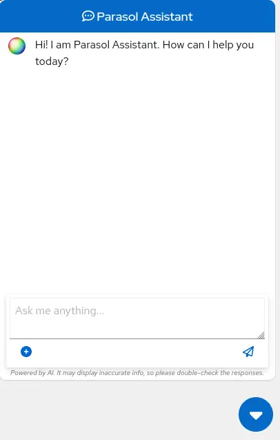

# AI를 보험 앱에 통합하기

이전 섹션에서는 InstructLab과 상호 작용하는 방법의 기본 사항을 보여주었습니다. 이제 예제 애플리케이션과 함께 InstructLab을 사용하여 한 단계 더 나아가 보겠습니다.
* RHEL AI를 사용하여 granite LLM을 활용
* 지식(knowledge) 및/또는 기술(skills) 형태로 추가 데이터를 더함
* 새로운 지식으로 모델을 학습
* 질문에 효과적으로 답할 수 있게 함
이는 보험 청구를 처리하는 가상 회사인 파라솔(parasol)의 맥락에서 수행됩니다.
<br>

**파라솔(parasol) 보험 시나리오**
파라솔에는 제출된 청구에 대한 수리 제안을 제공하는 AI(granite 모델)가 주입된 챗봇 애플리케이션이 있습니다.
* 목표
  - 이를 통해 파라솔은 보류 중인 다양한 청구를 신속하게 처리 가능
* 문제점 (Pain-Points / Challenges)
  - 하지만 현재 챗봇은 효과적인 수리 제안을 제공하지 않음
* 개선 방안
  - 여러가지 조건에서 수행된 다양한 수리를 포함하는 과거 청구 데이터를 사용하여 사용자가 이 지식을 granite 모델에 추가
  - 추가된 지식으로 모델을 학습
  - 권장 사항을 개선
<br>

## 파라솔 앱 사용

먼저 클레임 담당자가 챗봇과 상호작용할 때의 현재 경험을 살펴보겠습니다.

### 1. *Parasol*로 전환하여 브라우저에서 파라솔 회사의 클레임 신청서를 확인

</img><br>
* 청구 담당자는 화면에서 청구 번호를 클릭하여 기존 청구를 탐색하고 볼 수 있음

### 2. *Marty McFly*가 제기한 청구인 **CLM195501**을 조사

해당 청구를 클릭
</img><br>

* 이 페이지에서 청구 내용을 자세히 읽을 수 있음
* DeLorean 이미지를 확대하면 *Marty*가 자신의 차를 얼마나 심하게 파손했는지 확인할 수 있음
  - 바닥의 플럭스 커패시터에 주목

### 3. 챗봇 확인

청구를 읽은 후 페이지 오른쪽 하단에 있는 작은 파란색 아이콘을 사용하여 챗봇을 클릭

</img><br>

> [!NOTE]
> 챗봇은 이전에 제공한 Granite 모델에 의해 지원되므로 실행 중인 프로세스를 종료한 경우 다음을 실행하여 터미널에서 다시 시작해야 합니다.

### 4. 챗봇에 질문하기

청구 담당자로서 *Marty*의 DeLorean에서 플럭스 커패시터를 수리하는 데 드는 비용이 얼마인지 알고 싶다고 가정해 보겠습니다. 챗봇에 다음과 같이 입렵합니다.
```
How much does it cost to repair a flux capacitor?
```
</img><br>

> [!NOTE]
> 랩에서 한 것은, Prompt Engineering을 사용하여 LLM과의 각 대화에서 청구에 대한 맥락적 정보를 제공하는 것입니다. 하지만 안타깝게도 챗봇은 플럭스 커패시터를 수리하는 데 드는 비용이나 우리 조직의 도메인별 지식을 알지 못합니다.<br>
> <br>
> InstructLab과 RHEL AI를 사용하면 모델을 학습시켜 이를 바꿀 수 있습니다!
<br>

## 텍소노미(Taxonomy) 이해하기

<br>

## 합성 데이터 생성

<br>

## 모델 학습 및 제공

<br>

## 앱 검증

<br>